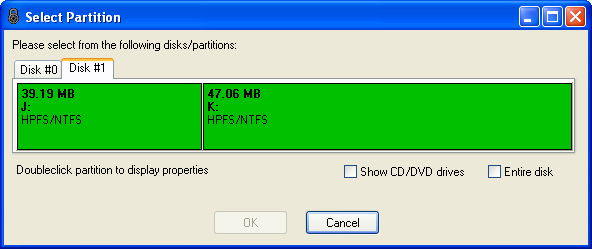
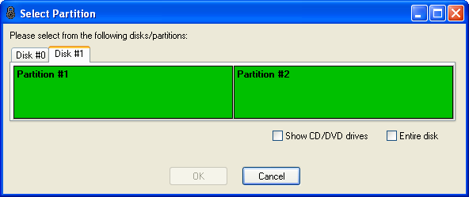

<meta content="text/html; charset=UTF-8" http-equiv="Content-Type">
<meta name="keywords" content="disk encryption, security, transparent, AES, OTFE, plausible deniability, virtual drive, Linux, MS Windows, portable, USB drive, partition">
<meta name="description" content="DoxBox: An Open-Source transparent encryption program for PCs. Using this software, you can create one or more &quot;DoxBoxes&quot; on your PC - which appear as disks, anything written to these disks is automatically encrypted before being stored on your hard drive.">

<meta name="author" content="Sarah Dean">
<meta name="copyright" content="Copyright 2004, 2005, 2006, 2007, 2008 Sarah Dean">
<meta name="ROBOTS" content="ALL">

<TITLE>FAQ</TITLE>

<link href="./styles_common.css" rel="stylesheet" type="text/css">

<link rel="shortcut icon" href="../src/Common/Common/images/DoxBox.ico" type="image/x-icon">

_[DoxBox](http://DoxBox.squte.com/): Open-Source disk encryption for Windows_

***

The latest version of this FAQ, along with the latest DoxBox user manual, can be found online at the [DoxBox web site](http://DoxBox.squte.com/)

* * *

<A NAME="level_3_heading_1">
### FAQ Contents
</A>

#### New
* [Why do I need to enable test mode?](#tm)
* [Why don't you just sign the drivers?](#tm)
* [Can I use DoxBox to open my Truecrypt containers?](#tc)
* [Will DoxBox support operating system encryption?](#os)
* [Is there any backdoor in DoxBox?](#bd)
* [What are the differences between DoxBox and Truecrypt?](#tc2)
* [Why does the documentation sometimes talk about FreeOTFE?](#fo)

<A NAME="level_4_heading_1">
#### General
</A>

* [What are the differences between DoxBox and DoxBox Explorer?](#gm)
* [How can I help the DoxBox project?](#el)
* [Which of the hash/cypher algorithms should I use?](#ey)
* [Which of the random number generators (RNGs) should I use?](#ez)
* [Is DoxBox based on CrossCrypt?](#aa)
* [Is DoxBox based on Linux's "losetup"?](#ab)
* [Right now, DoxBox supports losetup volumes; do you have any plans to include support for DriveCrypt, BestCrypt, etc volumes?](#ac)
* [When I mount a FAT/FAT32 formatted Linux volume under DoxBox everything works perfectly. When I do the same with myext2/ext3/Riesers/etc volume, I can't see my files!](#ad)
* [DoxBox comes with a set of command line decryption utilities! Can't anyone can just decrypt my data!](#ca)
* [Why do the Linux examples for LUKS/dm-crypt volumes show "losetup" being used twice?](#ae)
* [When I mount a volume and then view its properties under DoxBox, it states that the hash algorithm used is "n/a" - but I used a hash algorithm!](#af)
* [DoxBox is currently available for free - are you intending to "sell out" later, and start charging for it once enough users have been "hooked" on it?](#ah)
* [DoxBox may always be free, but will an "enhanced" version (which is charged for) with extra features be released (perhaps under a different name)?](#ai)
* [What about klonsoft's "LockDisk" and WinCrypto LLC's "CryptoDisk"? Aren't they paid-for packages which are based on DoxBox?](#ct)
* [Do DoxBox volumes have any kind of identifying "signature"?](#hg)
* [By examining a DoxBox/encrypted Linux volume file, can anyone tell what it is?](#ao)
* [What is "plausible deniability?"](#ap)
* [What do the numbers and letters after a hash name mean?](#aq_1)
* [What do the numbers and letters after a cypher name mean?](#aq_2)
* [When creating a new volume file, why do I get a message asking me to ensure I have XX.XX GB free on the relevant drive?](#hh)
* [I tried to create a large volume (> 4GB), and DoxBox stopped halfway through with an error - why?](#gc)
* [What is the largest volume that I can create?](#as)
* [Can I store an encrypted volume on a compressed NTFS drive?](#he)
* [What hash algorithms does DoxBox use?](#ha)
* [What encryption algorithms does DoxBox use?](#hb)
* [Which cypher modes does DoxBox support?](#cp)
* [Help! I forgot my password! I know it was something like...](#at)
* [Which is the best encryption algorithm to use?](#hd)
* [How safe is DoxBox?](#ax)
* [What happens if my volume file is corrupted or damaged in some way? Will I lose all my data?](#ay)
* [If someone steals my keyfile, will they be able to decrypt by data and read it?](#az)
* [How do I know DoxBox is encrypting my data, and with the encryption algorithm I choose?](#gt)
* [When selecting a cypher to use, why do the some cyphers appear multiple times?](#ba)
* [Why are there duplicated cypher drivers?](#bc)
* [Which of the duplicated drivers should I use?](#bd)
* [Can DoxBox generate keyfiles which **only** allow read only access?](#bi">)
* [When creating a new volume, how do I enable the sector IV options?](#dd)
* [Is DoxBox vulnerable to "watermarking" attacks?](#cb)
* [Is DoxBox vulnerable to "Cold Boot Attacks on Encryption Keys" (aka "DRAM attacks")?](#de)
* [Does DoxBox have any form of password recovery?](#ei)
* [Isn't DoxBox's "keyfile" functionality a security risk?](#ej)
* [What happened to the NULL hash and NULL/XOR cypher drivers?](#bn)
* [How do I resize an encrypted volume?](#gd)
* [How do I delete an encrypted volume?](#ge)
* [How do I backup an encrypted volume?](#et)
* [Can I use **any** filename/file extension for my DoxBox?](#hf)
* [Does DoxBox support LVM2?](#gw)
* [Is it worth running file overwriter ("shredder") programs to securely delete existing data stored on my encrypted drive?](#gx)
* [What is the difference between the main DoxBox/DoxBox Explorer release and the PortableApps.com version?](#gy)
* [What is the difference between the main DoxBox/DoxBox Explorer release and the U3 version?](#gz)
* [When dismounting a file based volume, what does DoxBox do with the file timestamps?](#hi)
* [What is volume "padding", and why would I want it?](#hs)
* [Why **wouldn't** I want to use padding?](#ht)

<A NAME="level_4_heading_2">
#### DoxBox Specific
</A>

* [When creating a DoxBox, the wizard shows me which stage of volume creation I am currently on - but it goes haywire, and the number of stages to complete keeps changing!](#ag)
* [Is it possible to dismount my DoxBox volumes when I hit a certain "hotkey"?](#aj)
* [Why can't I dismount my volume(s)?](#ak)
* [Why are the drivers written in C, but the GUI in Delphi?!](#am)
* [Why aren't I prompted to enter a password when creating a Linux volume?](#an)
* [Can I burn my volumes on a CD (or CDRW, or DVD), and mount them from there?](#ar)
* [Can I use DoxBox over a network?](#au)
* [Why do I get "Unable to connect to the DoxBox driver" errors?](#aw)
* [Why do I get prompted to select a driver whenever I attempt to mount some of my DoxBox?](#bb)
* [Do I need Administrator privileges to use DoxBox on my computer?](#cc)
* [Why do I need Administrator rights to install DoxBox?](#be)
* [Why do I need Administrator rights to start "portable mode"?](#bf)
* [Can DoxBox run under MS Windows 95/98/Me?](#bg)
* [Can DoxBox run under Linux?](#bh)
* [How can I get DoxBox to mount my volumes at startup/when I login?](#bk)
* [On the options dialog, what does the "Save above settings to" option do?](#cd)
* [Can I save my settings in the same directory as my DoxBox executable?](#ce)
* [Where, and in what order does DoxBox search for my settings?](#cf)
* [After associating DoxBox with ".box" files from the options dialog, I double-clicked my ".box" volume file, and nothing happened!](#ch)
* [What is the difference between the "Overwrite free space..." and "Overwrite entire drive..." options under the "Tools" menu?](#em)
* [Does DoxBox support encrypting data with multiple cyphers (aka "cascaded" cyphers, or "superencryption")](#eo)
* [DoxBox supports different languages, but why isn't mine listed?](#eq)
* [How do I translate DoxBox into a different language?](#er)
* [Can I defragment encrypted volumes?](#es)
* [Can I use DoxBox with my USB flash drive?](#cg)
* [Why doesn't DoxBox run automatically when I insert my USB drive?](#ew)
* [Can I use DoxBox with "MojoPac"?](#db)
* [Can DoxBox be used with RAID arrays?](#ee)
* [Does DoxBox try to connect to the internet?](#go)
* [How do I check DoxBox's exit code when passing parameters via the command line?](#gr)
* [Why won't DoxBox accept my password when supplied via the command line parameter?](#things)

* Partition based volumes

* [Do I have to partition my drive to use DoxBox?](#ea)
* [I want to create a DoxBox partition on my unallocated space, but can't see it in the partition display - where is it?](#eb)
* [When I'm prompted to select a partition, some of the partitions on my USB drive are shown in red (or not at all) - why?](#ec)
* [Why can't I use encrypted partitions on a USB drive, unless it's the first partition?](#ed)
* [After creating an encrypted partition, MS Windows reports that partition I used as being type "RAW" and prompts me to format it - why?](#bj)
* [How do I "hide" an encrypted partition such that MS Windows doesn't allocate it a drive letter?](#hk)
* [Why does the partition/disk selection display sometimes display less information?](#ek)
* [I accidentally selected the wrong disk/partition when creating a new volume and now can't see my files! How can I get my data back?](#eu)
* [Does DoxBox offer whole disk encryption?](#hp)

* Security Token/Smartcard Support (PKCS#11)

* [Do I **have** to use a security token/smartcard with DoxBox?](#fa)
* [What is the difference between PKCS#11, Cryptoki, and "tokens"?](#eg)
* [Does DoxBox encrypt my **entire** encrypted volume using my PKCS#11 token?](#ex)
* [I've inserted my PKCS#11 (Cryptoki) token, but why is the "PKCS#11 token management..." menu item disabled?](#ef)
* [How do I change the password on a volume/keyfile which is secured with a PKCS#11 secret key?](#eh)
* [Can I use more than one security token with DoxBox?](#gb)
* [Why don't all of my volumes automatically dismount when I remove my security token?](#ga)

* Windows Vista specific

* [Why do I get "unidentified program wants access to your computer" prompts when using DoxBox?](#bo)
* [Why does DoxBox prompt me to enter my Administrator's password?](#bp)
* [How do I stop the Windows Vista "consent/credential" (UAC) dialog from being displayed?](#cj)
* [What are the little "shield" icons shown next to some menu items?](#br)
* [I have problems starting any of the drivers under the 64 bit version of Windows Vista/Windows 7 - what's wrong?](#hl)

<A NAME="level_4_heading_4">
#### DoxBox Explorer Specific
</A>

* [Does DoxBox Explorer support drag and drop with MS Windows Explorer?](#gl)
* [Can Does DoxBox Explorer support drag and drop with MS Windows Explorer?](#hy)
* [What filesystems does DoxBox Explorer support?](#gj)
* [Does DoxBox Explorer try to connect to the internet?](#gp)
* [How do I securely overwrite files stored on a flash drive?](#hw)
* [How do I get DoxBox Explorer to display filename extensions for all files?](#hx)
* [Can DoxBox Explorer run under Linux?](#hy)

* * *
### New

*Q: Why do I need to enable test mode?*

*A:* Microsoft has decided to restrict users' freedom to do what they wish with the computers they own, by not loading device drivers by default unless they are approved of by Microsoft.

This is not a security feature because in order to gain approval you only need to pay a fee, so it does not prevent viruses, trojans, backdoors etc.

The main impact is on Open-Source projects such as DoxBox.

There are three possible reasons for this,

1. is that it is a direct source of revenue for Microsoft.
2. it means they can stop virtual devices from capturing audio and video and bypassing DRM. this is clearly not the only reason, as claimed by Microsoft, because it applies to all devices not just to audio & video drivers.
3. It gives Microsoft control over what users do with their PCs - turning them partly into Microsoft's PCs instead of under the control of the users who own them.
you can envisage Microsoft extending this to all software in the future, allowing them to charge a commission on every program sold, similar to the iPhone app store, or preventing apps being used that compete with Microsoft offerings, like LibreOffice.

* * *

*Q: Why don't you just sign the drivers?*

*A:* The cost of the Microsoft certificate is currently $178 payable every year.

Even if I had that in loose change lying around there's also the issue of whether its right to ask permission of Microsoft to use your own PC.
Diver signing may be a 'trial balloon' by Microsoft - to see how people react before extending it to app-signing. the easier people accept losing control over their drivers the more likely they will lose complete control of their PCs.

There are alternatives to DoxBox available on Linux, that are easy to use, secure, and do not need to be run in 'test mode'. DoxBox is provided mostly because people insist they *have* to use Windows for some reason, and have to have the extra security of an open source project. having to paste a single line into a command box is a small inconvenience compared to all the other problems of windows.

* * *

*Q: Why does the documentation sometimes talk about FreeOTFE?*

*A:* DoxBox is based on the FreeOTFE project. This project was abandoned after tis developer Sarah Dean mysteriously disappeared. Under the licence of FreeOTFE any derived project has to have a new name, so the GUI and most of the documentation talks about 'DoxBox'. The main driver is still known as the 'FreeOTFE Driver', and driver filenames contain 'FreeOTFE' because it was not required to change these to conform to the licence.

* * *

*Q: Can I use DoxBox to open my Truecrypt containers?*

*A:* DoxBox cannot open Truecrypt containers. A future version may have this ability. For now you should open your Truecrypt container using Truecrpt and copy your files to a native DoxBox.

* * *

*Q: Will DoxBox support operating system encryption?*

*A:* No. DoxBox supports full disc encryption if the OS is on another disc, but does not support encryption of the OS partition.

OS encryption is for higher security to encrypt information leaked to temp files, the registry, swap etc. but Windows and Microsoft software is inherently insecure, it has been known to leak data to [word documents](http://news.bbc.co.uk/1/hi/technology/3154479.stm) , to be pwned simply by [visiting a web] page(http://www.symantec.com/connect/blogs/emerging-threat-microsoft-internet-explorer-zero-day-cve-2014-1776-remote-code-execution-vulne), and an out-of-the box Windows machine is hacked within 4 minutes of [connecting to the internet](http://www.theregister.co.uk/2008/07/15/unpatched_pc_survival_drops/). it makes no sense to use Microsoft Windows if you need high security. I recommend using Ubuntu Linux which has full disc encryption as an install option for people who need this level of trust.  If you  use Windows and still are worried about leaking of temp files, registry etc, please see the section on ['best practices'](#best_practices)

* * *

*Q: Is there any backdoor in DoxBox?*

*A:* I don't know.

I have not found any in my brief maintenance of DoxBox. I have found a weakness in [deniability](#hid_bug), however this was certainly known about by the original developer and is a misfeature not a bug.

Every app may contain a security flaw, inadvertent or deliberate. software with the following features has the minimum risk of such flaws:
* open source. open source code can be checked by anyone. this means a flaw is more likely to be found out, which is a deterrent against putting one in (or allowing one to creep in). you get the benefits of open source even if you do not yourself check the code, in the same way as you benefit from safety inspections of your car even if you've never held a spanner yourself.
	DoxBox is open source and uses widely used public domain crypt libraries like libtomcrypt
* widely used and standard encryption algorithms. widely used ones have been studied more and are less likely to contain unknown flaws than proprietary ones.
	DoxBox uses standard encryption algorithms like 3DES and AES.
* widely used encryption schemes and formats. for the same reason ts are less likely to contain flaws than product specific ones.
	DoxBox supports the LUKs and losetup encryption schemes that are in most Linux distributions including secure ones used by enterprise, govt's and militaries. DoxBox allows you  to use ts on Windows
	

* * *
* 

*Q:What are the differences between DoxBox and Truecrypt?*

*A:* 
The known diferences are:
* DoxBox can open native LUKS containers
* Truecrypt has a Linux version available: tcrypt
* DoxBox suports multiple hidden containers, TC only one.	

* * *

*Q: How can I trust DoxBox?*

*A:* Review the source code to your satisfaction, and build your own (see section [Building DoxBox](technical_details__build_notes.md))

This is **strongly recommended**, and the best way of ensuring that the software is not compromised.

However, this is not always practical (many people are not familiar with how to read source code, or lack the required tools to build their own). In which case, **if** you trust the author, and the system on which the release was built on, then you may prefer to simply check the SHA-1 and PGP signatures associated with the binary release.

* * *

*Q: What's this about a flaw in deniability?*

*A:* 	
There is a known flaw in the way DoxBox handles Plausible Deniability (PD). For PD to work the file (or partition or disc) containing the Box must be filled with data indistinguishable m encrypted data.
However by default when creating a 'DoxBox' file, DoxBox only fills it with zeros. 
While there is a manual option to overwrite a file with crypto data there is a problem with this:
The fact that a user has done this on a file tells an attacker that this file contains a hidden box. even if the user does with on every Box created, the fact that this is done tells an attacker that at least one must have a hidden Box.

The solution is for all new boxes to be filled with random data by default. this will be implemented in the next version of DoxBox.

* * *

*Q: How should I use DoxBox for the best security?*

*A:* 	The most tested encryption scheme used by DoxBox is the LUKS scheme however the native scheme has some extra features. The most widely used supported cypher is AES.

In Windows numerous apps leak data to various places, including temp files, the registry, swap space, and your home folder.
To minimise this its recommended to only open files on your box using ['Portable Apps'](http://portableapps.com/). These generally won't save data in the registry or your home folder.
The portable apps should be installed on the Box itself, as they save their configuration, including MRU lists in the PortableApp directory.
Some other things to do:
- Schedule a free space erasing program to overwrite any free disk space regularly.
- Have a fixed size swap file - this reduces the chance swap will be left un-erased on the disk.
- Clean out your windows MRU list regularly.
- Use open source apps wherever possible.
- Use simple 'do one thing' apps (e.g. text editors instead of word processors) wherever possible.
-	enable Windows pagefile overwrite-on shutdown facility (see Microsoft knowledge-base article Q182086: How to Clear the Windows NT Paging File at Shutdown)

* * *

*Q: The help says I should have a keyphrase with one character per bit of the key. This is impossible to remember, so you must have made a mistake*

*A:* 	There is no mistake.

The normal way to attack encryption like this is to do a 'dictionary' attack that consists of trying many keyphrases automatically. this is because the keyphrase is normally the weakest part of the cypher. in order for the keyphrase to be as strong as the rest of the encryption, it has to have at least as much information content as the 'key' used internally ([*](#pass_note)).
The information content of normal English text is about [1.1](http://pit-claudel.fr/clement/blog/an-experimental-estimation-of-the-entropy-of-english-in-50-lines-of-python-code/) bits per character (including spaces), so for 256 bits it needs to be about 224 characters long or about 45 words. For comparison, the previous sentence contains 168 characters.

Using special characters and misspellings increases the information content slightly but not as much as you may think, and reduces the memorability/bit ratio.

<a name="pass_note">Not absolutely true because a brute force attack has to do the key set up (if a salt is used) to attack the keyphrase </a>

* * *

*Q: What should I use as a keyphrase?*

*A:* 	The keyphrase should be easy to remember and also long enough not to be broken by a brute force attack.

Using special characters like '%' or '$', or misspelling increases the bit content of the keyphrase but make it harder to remember accurately.
A common mnemonic [technique](http://www.academictips.org/memory/link.html) to remember lists is to make an absurd connection between pairs of images to form a series, each with an obvious word describing the image.
In WWII agents made up [poems](http://www.worldwar2history.info/war/espionage/code.html) that they memorised as keys to pen and paper cyphers. This would also work. See also [How do I memorise a long enough keyphrase?](#mem_pass)

* * *

*Q: How do I memorise a long enough keyphrase?*

*A:* 	There are 3 techniques that work:

* Use [mnemonics](http://www.academictips.org/memory/index.html)
* Write it down
	usually you should never write down the keyphrase but the idea here is to never have a written keyphrase and secret data at the same time, as follows.
	+ create a DoxBox with some files which are not secret but which you need to use frequently. create a secure keyphrase and write it down
	+ keep the paper with the keyphrase on you at all times. if it goes out of your sight at any time, make a new one and start again
	+ refer to the paper to unlock your box. as you reuse it you will start to remember it better.
	+ when you are sure you can remember the keyphrase
		- destroy the paper
		- start using your box for secure data
* Increase it gradually	
	+ create a DoxBox with some data on you need to use frequently but which is not secret. Use a simple keyphrase, e.g. one word.
	+ when you have used the keyphrase often enough you are sure you remember it thoroughly, add another word to the keyphrase.
	+ repeat until the keyphrase is long enough, then
	+ start using your box for secure data	

* * *

<A NAME="level_3_heading_2">
### General
</A>

* * *

*Q: What are the differences between DoxBox and DoxBox Explorer?*

*A:*
Please see the [DoxBox v. DoxBox Explorer Comparison](http://DoxBox.squte.com/main_explorer_differences.html)

* * *

*Q: How can I help the DoxBox project?*

*A:* If you are a native speaker of a language other than English, please take a look at [translating DoxBox](http://DoxBox.squte.com/translations.html) page. The user interface has support for translations into different languages, though at present the actual number of translations into other languages is fairly limited.

Alternatively, **FEEDBACK!** If you have any comments or suggestions for how DoxBox can be improved - get in touch!

 * * *
 
*Q: Which of the hash/cypher algorithms should I use?*

*A:* This decision is left up to the user.

Most users can simply accept the default algorithms offered, which provides a fairly high degree of security.

* * *

*Q: Which of the random number generators (RNGs) should I use?*

*A:* This decision is left up to the user.

Using more than one RNG increases the security offered by DoxBox as the combined random data generated will be at least as random as the most random RNG selected. Should one of the RNGs subsequently be found to be weak (i.e. producing data that is not as random as it should be), the random data used will still be as strong as the strongest RNG used.

See the [Technical Details: Random Number Generators (RNGs)](technical_details__RNGs.md) section for further information.

* * *

*Q: Is DoxBox based on CrossCrypt?*

*A:*
This answer was given by the original developer of FreeOTFE, the project DoxBox is based on:

> The answer to that is an emphatic **NO**! FreeOTFE and CrossCrypt are two **completely** separate projects, written by completely different people.

> It's easy to see why users may get the idea that FreeOTFE is based on CrossCrypt; CrossCrypt was released first, and the CrossCrypt's GUI (CrossCryptGUI) looks practically identical to FreeOTFE's interface.
 The reality is that **CrossCrypt** itself is a command line based OTFE system; it has no GUI. **CrossCryptGUI** was a project I created to provide a GUI to CrossCrypt to improve its ease of use.

> In actual fact, far from FreeOTFE looking a lot like CrossCryptGUI, it's actually the other way around - CrossCryptGUI looks a lot like FreeOTFE! The Delphi GUI to FreeOTFE was already developed before CrossCrypt was released. For the sake of expediency, I dropped the CrossCrypt Delphi component I wrote into FreeOTFE's GUI, hijacking it to produce CrossCryptGUI; a cannibalized version of the FreeOTFE interface.

> The cyphers supplied with the first public release of FreeOTFE (v00.00.01) were the same as those used by CrossCrypt. Originally I had planned to release the first beta of FreeOTFE for compatibility testing with only the NULL, XOR, DES and AES cyphers; these apparently being the most common cyphers used with Linux volumes. After CrossCrypt was released (which uses AES and Twofish) DES was the only cypher in the above list I had not implemented. I decided to switch from DES to Twofish in order that people without Linux could easily use CrossCrypt to verify that FreeOTFE was operating correctly with AES and Twofish volumes (and vice versa; benefiting both systems).

> Since its initial release, FreeOTFE has seen significant developments, including support for many more hashes, cyphers, and other options.

* * *

_Q: Is DoxBox based on Linux's "losetup"?_

*A:* This answer was given by the original developer of FreeOTFE, the project DoxBox is based on:
> No, FreeOTFE is a completely separate project in its own right. It was only after I realised how "simple" Linux encrypted losetup volumes are (they are nothing more than an encrypted partition image), that I added support for them into FreeOTFE.

> Having said that the format of losetup volumes are "simple" - have you **any idea** how many different options, combinations, etc it has?! Each option on its own may be relatively simple, but there are a fair number of them...! (See the relative complexity of the DoxBox's Linux mount dialog - you have to tell it everything!)

* * *

*Q: Right now, DoxBox supports LUKS volumes; do you have any plans to include support for Truecrypt, DriveCrypt, BestCrypt, etc volumes?*

*A:* It's possible this will happen /if/ you have the corresponding application installed. Support in a standalone installation of DoxBox will not happen as there is no standard for OTFE volume files (each system uses its own layout). Adding support for other OTFE systems is non-trivial, and few OTFE systems have released proper technical documentation into the public domain.

 * * *
 
*Q: When I mount a FAT/FAT32 formatted Linux volume under DoxBox everything works perfectly. When I do the same with my ext2/ext3/Reisers/etc volume, I can't see my files!*

*A:* DoxBox does one thing: when a volume file is mounted, DoxBox presents a new storage device to the operating system.
 Like all OTFE systems, it has no comprehension **at all** of what FAT/FAT32/NTFS, let alone ext2/ext3/etc - understanding lies well *outside the scope of an OTFE system*, and is the responsibility of the filesystem drivers installed.

Although Microsoft Windows does come with filesystem drivers for FAT/FAT32/NTFS, it does not (natively) support other filesystems such as ext2.

As a result, in order to read/write to your encrypted Linux volumes under Microsoft Windows, you will need to either:

1. Format the volume under Linux using one of the filesystems Microsoft Windows understands (e.g. FAT), or
1. Install 3rd party software on your Microsoft Windows system, which provides the filesystem (e.g. ext2) that you wish to use

* * *

*Q: Why do the Linux examples for LUKS/dm-crypt volumes show "losetup" being used twice?*

*A:* This actually has **nothing** to do with DoxBox(!), but appears to be an oddity with "mkdosfs"/dm-crypt.

Although this section of the documentation shows:

		losetup /dev/loop1 /dev/mapper/myMapper
		mkdosfs /dev/loop1

you should be able to simply use:

		mkdosfs /dev/mapper/myMapper

However, when this section of the documentation was written and tested (under Fedora Core 3, with a v2.6.11.7 kernel installed and using cryptsetup-luks v1.0), this shorter (and more sensible) version resulted in mkdosfs generating the following error:

		# mkdosfs /dev/mapper/myMapper
		mkdosfs 2.8 (28 Feb 2001)
		mkdosfs: unable to get drive geometry for '/dev/mapper/myMapper'

YMMV, though you may well find that formatting the volume with a different filesystem will remove the "double loop" issue. (Please note though, that if you are intending to encrypted volumes which don't use FAT/NTFS under Microsoft Windows, you will need a suitable filesystem driver)

* * *

*Q: DoxBox comes with a set of command line decryption utilities! Can't anyone just decrypt my data?*

*A:* The decryption software included with DoxBox is **completely useless** without the password used to encrypt your data. And anyone with **that** information can decrypt your data anyway!

The command line decryption utilities are not some form of "password cracking" tool - far from it; they actually act to increase your security by allowing you to verify that encryption is actually taking place.

 * * *
 
*Q: When I mount a volume and then view its properties under DoxBox, it states that the hash algorithm used is "n/a" - but I used a hash algorithm!*

*A:* The hash algorithm shown is the one used to generate sector IVs. If the sector IV generation method used does not require the use of a hash algorithm (see the "Sector IVs" item on this dialog), "n/a" will be displayed for the hash algorithm.

This is separate from any hash algorithm used to process your password, which in the case of DoxBox volumes can be seen in the output file of a CDB dump (select "Tools | Critical data block | Dump to human readable file..."), or in the case of Linux volumes, is specified at time of mounting.

* * *

*Q: DoxBox is currently available for free - are you intending to "sell out" later, and start charging for it once enough users have been "hooked" on it?*

*A:* DoxBox is Open-Source, meaning that if any changes are made that many people disapprove of it is likely to be 'forked', with the 'fork' retaining the original features (such as being gratis). If you are concerned you should make your own copy of the source.

  * * *
 
*Q: What about klonsoft's "LockDisk" and WinCrypto LLC's "CryptoDisk"? Aren't they paid-for packages which are based on DoxBox?*

*A:* This answer was given by the original developer of FreeOTFE, the project DoxBox is based on:
> Both "LockDisk" and "CryptoDisk" are unlicensed (and unlicensable) commercial rip-offs of FreeOTFE. They are based on FreeOTFE's source code (and only a beta version at that in the case of "LockDisk") and, because they are closed-source, are in direct violation of DoxBox's licence.

> I have nothing to do with either "LockDisk" or "CryptoDisk", nor any involvement in their creation.

> Personally, I would **strongly recommend against** using these products:

> * They have less functionality than DoxBox
> * They're closed source; there's no way of knowing how secure it is, or what it does
> * It is not possible to (legally) obtain a licence for these products
> * In the case of "LockDisk" the so-called "free" version is **severely** crippled (only permitting 35MB volumes)
> * In the case of "LockDisk", it's based on a pretty old and now obsolete (v0.59 BETA) version of FreeOTFE
> * And for all this, you have to **pay for them?!!**
>
>
> I could list another few dozen reasons for not using these products, but I think you get the picture - DoxBox is simply better!

* * *

*Q: Do DoxBox volumes have any kind of identifying "signature"?*

*A:*
No!

Please see the FAQ: [By examining a DoxBox/encrypted Linux volume file, can anyone tell what it is?](#ao) for further information.

* * *

*Q: By examining a DoxBox/encrypted Linux volume file, can anyone tell what it is?*

*A:* Neither DoxBox nor encrypted Linux volumes have any kind of "signature" that would allow an attacker to identify them for what they are.

  In particular, the "critical data block" in every DoxBox volumes is encrypted, and as such it is not possible to identify it for what it is

  * * *
 
*Q: What is "plausible deniability?"*

*A:* See the documentation section on ["Plausible Deniability"](plausible_deniability.md) for details.

 * * *
 
*Q: What to the numbers and letters after a hash name mean?*

*A:* When required to choose which hash you wish to use, DoxBox will present you with a list of all hashes that are provided by the DoxBox drivers installed. These lists will display hash names in the format:

> *&lt;hash name&gt;* (**&lt;hash length&gt;**/**&lt;block size&gt;**)

Note: The hash length and block sizes shown are in bits, not bytes.

For example:
> SHA-512 (512/1024)

This indicates that the hash used is SHA-512, which generates 512 bit hash values, and processes data in 1024 bit blocks.

If the hash length shown is zero, then the hash generates no output.

If the hash length shown is "-1", then the length of the hash values returned can vary.

If the block size is "-1", then the hash processes data using a variable block size.

Typically, when presented with a selection of different hashes to choose from, you will see a "?" or "..." button next to the list; clicking this button will display full details on the driver.

* * *

*Q: What to the numbers and letters after a cypher name mean?*

*A:* When required to choose which cypher you wish to use, DoxBox will present you with a list of all cyphers that are provided by the DoxBox drivers installed. These lists will display cypher names in the format:
  > *&lt;cypher name&gt;* ([**&lt;mode&gt;**; ] **&lt;key size&gt;**/**&lt;block size&gt;**)

Note: The key and block sizes shown are in bits, not bytes.

For example:

> AES (XTS; 256/128)

This indicates that the cypher is AES, operating in XTS mode with a key size of 256 bits and a block size of 128 bits.

If the key size shown is zero, then the cypher does need take a key (password) to carry out encryption (e.g. the "Null" test cypher).

If the key size shown is "-1", then the cypher can accept keys of arbitrary size.

If the block size is "-1", then the cypher encrypts/decrypts arbitrary block size.

Typically, when presented with a selection of different cyphers to choose from, you will see a "?" or "..." button next to the list; clicking this button will display full details on the driver.

* * *

*Q: When creating a new volume file, why do I get a message asking me to ensure I have XX.XX GB free on the relevant drive?*

*A:*
If you get an error stating that:

> Unable to create volume file; please ensure you have XX.XX GB free on the relevant drive

during volume creation, this is probably because the drive you are trying to create the volume on is formatted as FAT/FAT32 - both of which have a file size limit of 4GB.

Please see the FAQ "[I tried to create a large volume (> 4GB), and DoxBox stopped halfway through with an error - why?](#gc)"

* * *

*Q: I tried to create a large volume (> 4GB), and DoxBox stopped halfway through with an error - why?*

*A:* The most probable cause for this is that you were creating a volume file on a FAT/FAT32 filesystem, however FAT/FAT32 filesystems cannot support files larger than (4 GB - 1 byte).

See the FAQ: [What is the largest volume that I can create?](#as) for further information and how to resolve this.

  * * *
 
*Q: What is the largest volume that I can create?*

*A:* DoxBox has a theoretical maximum volume size of 2^64 bytes (16777216 TB; 17179869184 GB). For fairly obvious reasons, I have not had the opportunity to test a volume this size!

In practice however, although partition based volumes may be able to realise volumes as large as this, file-based volumes may find that limitations with the filesystem that the volume file is to be stored upon may prevent this limit from being reached.

For example, a FAT32 drive cannot store a volume file which is 4GB or larger. In practical terms, this means that the largest volume you can create on a FAT32 filesystem is 3999 MB. An NTFS formatted drive **can** store volume files **much** larger; in excess of FAT32's 4GB limit, and up to DoxBox's maximum size stated above.

* * *

*Q: Help! I forgot my password! I know it was something like...*

*A:* Oops. That was silly of you, wasn't it?

If you've secured your volume with something like AES, then you can pretty much kiss goodbye to your data.

If you know what most of your password is though, then you could certainly write an application which would carry out a brute force attack on your volume, assuming those known characters. How long this would take to run would depend on the cypher used, the strength of your password, and how much you remember of it.

Note: This is not a security risk; that last comment **equally applies** to pretty much **any** OTFE system which has been implemented correctly.

* * *

*Q: Can I store an encrypted volume on a compressed NTFS drive?*

*A:*
Yes, though there is nothing to be gained from compressing encrypted data, as it is unlikely to compress by any significant amount (if at all)

* * *

*Q: What hash algorithms does DoxBox use?*

*A:*
A full list of the hash algorithms used by DoxBox can be found on the [introduction page](description.md)

* * *

*Q: What encryption algorithms does DoxBox use?*

*A:*
A full list of the cyphers and cypher modes used by DoxBox can be found on the [introduction page](description.md)

* * *

*Q: Which cypher modes does DoxBox support?*

*A:* With the exception of the NULL and XOR cyphers, DoxBox offers CBC, LRW and XTS modes, and has the flexibility for other modes to be easily added by simply changing drivers.

A full list of the cyphers and cypher modes used by DoxBox can be found on the [introduction page](description.md)

* * *

*Q: Which is the best encryption algorithm to use?*

*A:*
**That** is a difficult question to answer!

The best advice that can be given here is to research the cyphers available, and make your own decision based on your particular security requirements.

DoxBox defaults to using the AES-256 cypher in XTS mode together with SHA-512 for hashing. This should prove more than enough for the overwhelming majority of users.

* * *

*Q: How safe is DoxBox?*

*A:* DoxBox is about as pretty much just as safe as writing directly data to your hard drive, without DoxBox encrypting it (see also the FAQ: "[Help! I forgot my  password! I know it was something like...](#ay">What happens if my volume file is corrupted or damaged in some way? Will I lose all my data?</a>")

If you forget your password however, then by definition you will not be able to recover your data (see also the [FAQ](#at)")

* * *

*Q: What happens if my volume file is corrupted or damaged in some way? Will I lose all my data?*

*A:* As with pretty much **all** OTFE systems, if you were to corrupt a DoxBox is some way, the damage your data would receive would be about the same as if you had stored it directly on your hard drive, without DoxBox encrypting it.

  For example: If you mount a DoxBox file and then write a byte of data, at random, to somewhere on that mounted drive, the effect would be exactly the same as if you had randomly written the same byte to a real hard drive.

On the other hand, if you were to write a byte to data to a random location within an unmounted DoxBox, then the amount of damage caused would dependant on where that byte was written:

1. If the volume file was created with a critical data block (CDB) at the start of it, and the byte was written to the first 512 bytes of the volume file (where the CDB is located), then the volume would be unmountable, unless you had made a backup of this area of your volume, or created a keyfile - in which case, you could restore from your backup/mount from your keyfile, and continue as if nothing had happened.
2. If the volume file was created without a critical data block, or the byte was written to any other part of your volume file, then the sector that corresponded to the location that the byte was written to would be corrupted from approximately the point the byte was written, to the end of that sector; a maximum of 512 bytes.

To protect against (1), DoxBox included functionality to backup a volume's CDB (see "Tools | Critical data block... | Backup..."), and to create keyfiles (see "Tools | Create keyfile...")

Should case (2) occur, the damage to your volume would be minimal (up to a maximum of 512 bytes), and restricted to the sector that was corrupted.

* * *

*Q: If someone steals my keyfile, will they be able to decrypt my data and read it?*

*A:* No, not unless they have the keyfile's password as well.

  Keyfiles are encrypted. Without the password used to encrypt it, a keyfile is pretty much just a useless block of random data.

 * * *
 
*Q: How do I know DoxBox is encrypting my data, and with the encryption algorithm I choose?*

*A:*
To verify that encryption/decryption is taking place for Linux volumes, create an encrypted volume using Linux; then mount it using DoxBox.

The encrypted Linux volume will be fully readable (and writable) using DoxBox - confirming that the same encryption is taking place under DoxBox as Linux.

For DoxBox volumes, the critical data block can be dumped out (see "Tools | Dump to human readable file..." menu), and the master encryption key used to mount the same volume under Linux (offsetting for the CDB) - again proving that encryption is taking place.

*WARNING:* **Contrary to popular belief**, a user interface which accepts and processes encryption test vectors does **not prove anything!**  It is a trivial task to take a secure cypher, and use it to process test vectors provided by the user, while actually using a very weak and insecure cypher to carry out encryption/decryption on the data being stored!

* * *

*Q: When selecting a cypher to use, why do the same cyphers appear multiple times?*

*A:* This is because you have more than one version of a particular cypher driver installed. See also: [Why are there duplicated cypher drivers?](#bc)

  * * *
 
*Q: Why are there duplicated cypher drivers?*

*A:* The "duplicated" drivers implement the same algorithms, but are built from different crypt libraries. For example, there are three Twofish drivers; one based on the Hi/fn and Counterpane Systems Twofish implementation, another which uses the libtomcrypt implementation, and a third which relies on the Gladman implementation.

They redundant drivers are primarily intended to allow verification of the implementations and increase confidence that they're actually doing what it's supposed to do.

These duplicated drivers do exactly the same thing. It is recommended that if you
wish to use a cypher which has multiple supplied drivers, that you uninstall one of them. (See
also: [Which of the duplicated drivers should I use?](#bd))

* * *

*Q: Which of the duplicated drivers should I use?*

*A:* It doesn't particularly matter too much; they both do exactly the same thing, but are based on different implementations.

Simply choose one and uninstall the other.

  * * *
 
*Q: Can DoxBox generate keyfiles which **only** allow read only  access?*

*A:* Not at present, though if I receive enough requests for it, I may add this functionality.

Until then, it should be borne in mind that anyone with a "read only" keyfile has, pretty much by definition, a copy of your master key and so has the potential to modify their "read only" keyfile, turning it into a "read-write" keyfile.

i.e. It is debatable how much use this functionality has; certainly it
should not be relied upon to prevent users from gaining write access to
your volume files.

* * *

*Q: When creating a new volume, how do I enable the sector IV options?*

*A:* Sector IVs are only used with cyphers using CBC mode; to enable the sector IV options, select an encryption algorithm which operates in CBC mode.

If you select a cypher which uses either LRW or XTS, the IV options are automatically disabled as these algorithms don't use them.

 * * *

*
Q: Is DoxBox vulnerable to "watermarking" attacks?

*A:* DoxBox volumes are **not** vulnerable to watermarking attacks, as long as they are created with a cypher using:

* XTS mode
* LRW mode
* CBC mode with ESSIV

(see the "Create new volume" wizard, encryption settings step).

By default, DoxBox creates volumes using XTS mode. Users would have to **deliberately** create their volumes using CBC mode with predictable IVs in order to be vulnerable to this type of attack.

* * *

*Q: Is DoxBox vulnerable to "Cold Boot Attacks on Encryption Keys" (aka "DRAM attacks")?*

*A:* No, it isn't - assuming common sense is used.

**Description**

A "cold boot attack" involves rebooting a computer which has been handling sensitive information, and dumping contents of its memory out to a  disk in order to try to examine information stored in memory immediately prior to rebooting. This form of attack is detailed at [http://citp.princeton.edu/memory/](http://citp.princeton.edu/memory/faq/)

This attack is **nothing new**, and has been well known for a **long** time; despite the disproportionate amount of attention it's now getting.

**Solution**

If you mount an OTFE volume, and simply walk away from your computer, the encryption keys used to secure your volume will be held in your computer's physical
memory (obviously). If someone reboots your computer at that point, there is a risk they could successfully recover your encryption key.

However, it is not generally recommended that you simply **walk away from your computer while you have volumes mounted** - if anyone can come along and attempt to launch the above attack, THEY CAN SIMPLY READ THE CONTENTS OF YOUR ENCRYPTED VOLUME DIRECTLY ANYWAY!

If you dismount your volumes after using them, the DoxBox driver overwrites all sensitive data (key information, etc) that it holds before releasing it - which should prevent the above attack.

If you suddenly press your computer's power off button or reset it (i.e. using the physical "power off" button on the front of its case) **while a volume is  mounted**, then an attacker could theoretically dump out your encryption keys using this attack. Please note that:

1. **All** encryption systems are susceptible to this attack, since they have to store encryption keys in memory in order to use them
2. **Regardless of whether you use any form of disk encryption or not**, it is not recommended that you do power off/reset your computer without first shutting down cleanly via the "Start -> Turn off computer"!

To prevent this attack in the situation described above, ensure that the computer remains powered off for several minutes after it is turned off in order for the contents of RAM to effectively "bleed away"

**Summary**

In summary, to completely remove the threat of this attack against your encryption keys:

1. Dismount volumes after you have used them
2. If you must power off your computer **while one or more volumes are mounted**: prevent anyone from powering it back on and dumping it's memory out for at least the first few minutes after it was powered off (or the first 15-20 minutes if they open up the case and spray coolant on the memory chips)

In short - just use common sense.

**Notes**

It should be noted that this attack is **not limited in any way to disk encryption systems**. The focus on these systems by the authors of the above paper is a red herring. Essentially the attack consists of attempting to take a snapshot of the PC's memory at the time it was reset, which can then be picked over at leisure. **Any** encryption system can be attacked in this way.

Furthermore, because this attack may allow whatever was in the computer's memory at the point it was rebooted to be recovered, it should also be noted that any information that applications had in memory at the time the computer is reset (e.g. a document open in Microsoft Word, or image being displayed on the screen) may potentially be recovered. Disk encryption systems encrypt data stored on disks - not in RAM.

* * *

*Q: Does DoxBox have any form of password recovery?*

*A:* Yes; DoxBox keyfiles can be used to provide a form of password recovery; see the [Getting Started Guide](getting_started.md)

* * *

*Q: Isn't DoxBox's "keyfile" functionality a security risk?*

*A:* No. In order to create a keyfile, both the volume and the volume's password (or an existing keyfile, and that keyfiles password) are required.

If an attacker already has this information, your security has already been compromised anyway.

* * *

*Q: What happened to the NULL hash and NULL/XOR cypher drivers?*

*A:* To improve performance, these drivers have been moved into a "weak drivers" directory. Really, you shouldn't be using these drivers at all; they are of little use from a security perspective, and are only really included to allow testing. They're still included with the release though, if you **really** need them...

 * * *

*Q: How do I resize an encrypted volume?*

*A:* To change the size of an encrypted volume:

1. Mount your existing volume
1. Create a new DoxBox of the size required
1. Mount the new volume (overwriting and formatting it if needed)
1. Copy all data from the old volume to the new one
1. Dismount both volumes
1. Delete the old volume

Obviously, this procedure requires enough storage space to hold both the old and newly created volumes.

It should be noted that, although a number of **other** disk encryption systems **claim** to offer volume resizing functionality, they typically either carrying out the procedure above "behind the scenes" (often failing completely if insufficient storage is available to hold the new volume), or by storing the volume in a "sparse" files - which can lead to security leaks.

* * *

*Q: How do I delete an encrypted volume?*

*A:* If your volume is stored within a file, simply dismount the volume if already mounted, and delete the file.

IMPORTANT: Before deleting a volume file, make sure that you mount it first and copy any information stored in it to somewhere safe! Once deleted, you will lose access to your encrypted volume, and anything it contains!

* * *

*Q: How do I backup an encrypted volume?*

*A:* How you backup an encrypted volume depends on whether it is a file or partition based volume. In both cases however, volumes should be **dismounted** before being backed up.

*For file based volumes*

A file based volume is a file just like any other (albeit a fairly big one); simply let your backup software backup the volume as it chooses, and your data should be safe.

This will work regardless of what backup software you use, though you may wish to turn off DoxBox's time-stamp reverting functionality in order for your backup software to identify when volumes have been changed. (See "View | Options..." dialog, "General" tab, "Revert volume timestamps on dismount")

*For disk/partition based volumes*

Whether you can backup disk/partition based volumes depends on the backup software being used. If your backup software takes a **literal** backup image of a disk/partition, then it should successfully backup DoxBox volumes (even if the backup copy is compressed). However, not all backup systems do this, and instead try to be "smart" about what they store to backup - and fail to backup everything they need to.

(This issue is true for all disk encryption systems, not just DoxBox)

For example, with [Paragon Drive Backup](http://www.paragon-software.com/), if you create an encrypted volume using an **entire disk** (i.e. without creating a partition on the disk, and encrypting that partition), Paragon Drive doesn't appear to think there's anything worth backing up (i.e. it doesn't see any partitions **to** backup) and therefore backs up  practically nothing. As a result, it will **not** back up your volume correctly.

However! If you create an encrypted volume on a **partition** (even one filling the entire drive), and back that partition up, Paragon Drive Backup does what it **should** do - generates a compressed backup copy of the **entire** partition, which can then be restored back later.

No matter **what** you're backing up, when you setup a backup system for the first time, it is **strongly recommended** that you go through the restore process at least **once** before "setting it and forgetting it". The **absolute worst** time for learning how your software's restore function works is when you actually need it (e.g. after a disk failure, and you want to get your data back)  This advice applies to *ALL* backups, and not just backups of DoxBox volumes.  By doing a "dry run", you can have confidence in both your backups, and in your ability to use them should you need to.    

* * *

*Q: Can I use **any** filename/file extension for my DoxBox?

*A:*
Yes!

Filenames and file extensions have no special meaning to DoxBox, which means any filename can be used.

* * *

*Q: Does DoxBox support LVM2?*

*A:*
Yes - it certainly can!

DoxBox fully supports Linux LVM2 volumes, provided that you have a suitable Windows driver which allows access to LVM2 volumes, this will allow DoxBox to carry out disk encryption either above or below the LVM management system (i.e. on physical or logical volumes)

(It should be noted however that LVM2 is **not** a disk encryption issue!)

* * *

*Q: Is it worth running file over-writer ("shredder") programs to securely delete existing data stored on my encrypted drive?*

*A:*
For most users, no - it would only have the effect of replacing encrypted files with encrypted garbage; neither is particularly useful to an attacker.

However, if you have concerns of an attacker being able to gain your password (and other details required to decrypt your encrypted volume), it may still be wise to overwrite data before its deletion. This way, should an attacker be able to decrypt your volume(s), they will not be able to use data recovery tools to retrieve sensitive data.

* * *

*Q: What is the difference between the main DoxBox/DoxBox Explorer release and the PortableApps.com version?*

*A:*
The PortableApps.com version is identical to the main DoxBox/DoxBox Explorer release, but includes an additional:

* "Launcher" executable, which simply starts DoxBox.exe/DoxBoxExplorer.exe
* Directory structure required to integrate it into the PortableApps.com menu software.
* Configuration files required to integrate it into the PortableApps.com menu software.

Further, the installer has been created using the PortableApps.com installer-creator software instead of the standard DoxBox innosetup installer, and the translation source files (".po" files, which aren't needed to use the software) have been removed.

* * *

*Q: What is the difference between the main DoxBox/DoxBox Explorer release and the U3 version?*

*A:*
The U3 version is identical to the main DoxBox/DoxBox Explorer release with the exception that a slightly different directory structure is used to support the U3 platform, and the translation source files (".po" files, which aren't needed to use the software) have been removed.

The ".u3p" file is simply a ZIP archive which has been renamed; it may be renamed to have a ".zip" file extension and uncompressed to verify its contents.

* * *

*Q: When dismounting a file based volume, what does DoxBox do with the file timestamps?*

*A:*
By default, when mounting file based volumes, DoxBox stores the volume file's timestamps, and resets them back again after dismounting. This is carried out for security reasons (see section on [plausible deniability](plausible_deniability.md)).

This functionality can be turned off if needed (e.g. to assist backup processes; see FAQ "[How do I backup an encrypted volume?](#et)") by turning off the "Revert volume timestamps on dismount" option on the Options dialog ("View | Options").

* * *

*Q: What is volume "padding", and why would I want it?*

*A:*
A number of tools are available to "detect" encrypted volumes. These typically operate
by detecting large files with a high amount of entropy and a file size that is a multiple of 512 bytes, or which is a certain "signature size" greater than the last 1MB boundary.

"Padding" is additional (random) data added to the end of the volume, and is used to prevent detection of DoxBox volumes by automated volume-finding tools which only carry out a cursory search for volumes, and rely on the size of files found.

Furthermore, padding also reduces the amount of information an attacker has about a volume, by preventing reliable detection of the size of the mounted volume (subject to the mounted volume being overwritten as described in the [Plausible Deniability](plausible_deniability.md) section).

Padding will not prevent a reasonably knowledgeable IT person from being able to reasonably identify an encrypted volume as such - like any security mechanism, padding is simply another tool which would be employed from a larger toolbox. For this reason, it is **not** recommended that padding be relied upon to help secure data against an attacker, and users considering using padding may benefit from reading the section on ["Plausible Deniability"](plausible_deniability.md)

* * *

*Q: Why **wouldn't** I want to use padding?

*A:*
Padding takes up additional storage on your hard drive beyond that required by the volume file.

* * *

<A NAME="level_3_heading_3">
### DoxBox Specific (PC)
</A>

* * *

*Q: When creating a DoxBox, the wizard shows me which stage of volume creation I am currently on - but it goes haywire, and the number of stages to complete keeps changing!*

*A:* The number of different stages to creating a new DoxBox varies, depending on what options you choose - for example, if you elect to the mouse movement to generate random data, then you will have to complete an extra step to actually generate this random data; if you switch to using the Microsoft CryptoAPI for generating random data, you can skip that step, as it is done for you automatically.

  * * *
 
*Q: Is it possible to dismount my DoxBox volumes when I hit a certain "hotkey"?*

*A:* Yes; see under "View | Options..." - the "Hotkeys" tab

 * * *
 
*Q: Why can't I Dismount my volume(s)?*

*A:* The most common reason for this is because DoxBox cannot gain an exclusive lock on the associated drive. This is normally caused by one or more files being open on the encrypted volume.

"Normal" (non administrator) users may also have problems dismounting drives (see the TODO list in this documentation)

If a volume cannot be dismounted "normally", you will be prompted if you want to forcefully dismount it; it is only recommended that volumes are dismounted in this way if all open files and documents are closed.

* * *

*Q: Why are the drivers written in C, but the PC versions GUI in Delphi?!*

*A:* Good question. The drivers are written in C as the DDK pretty much requires it. The PC GUI is in Delphi as this was the easiest for me to implement.

  * * *
 
*Q: Why aren't I prompted to enter a password when creating a Linux volume?*

*A:* This is covered in the documentation; see section relating to creating Linux volumes.

In a nutshell, creating a Linux volume only requires a file to be created of the appropriate size. It is when the volume is subsequently mounted that a password is required; the same process as when creating an encrypted Linux volume under Linux.

  * * *
 
*Q: Can I burn my volumes on a CD (or CDRW, or DVD), and mount them from there?*

*A:* Yes; at the end of the day, volume files are just plain straight (albeit very large) files. Just ensure that when you mount them, you mount them as **read only** volumes, (for obvious reasons - even with CDRWs).

It is recommended that volumes which are to be written to CD are formatted using either the FAT or FAT32 filesystem. NTFS volumes will work, though AFFAIK Windows 2000 is unable to mount NTFS volumes read only (meaning the volume must be copied back to your HDD, the file set to read/write, and **then** mounted).

  * * *

*Q: Can I use DoxBox over a network?*

*A:* Yes. By installing DoxBox on the computers you wish to access your data from, you can mount a volume file located on a networked server.

When mounting over a network, simply specify the UNC path (e.g. \\servername\sharename\path\volumefilename) to the volume file begin mounted.

When a volume is mounted over a network in this way, all data read/written to that volume will be sent over the network in encrypted form.

If you wish to mount a networked volume file by more than one computer at the same time, you may do so provided that they all mount the volume read only. If any computer has a volume file mounted as read/write, you should dismount all other computers (even if they were accessing the volume as read only), and ensure no other computer mounts the volume until the computer mounted as read/write has dismounted.

* * *

*Q: Why do I get "Unable to connect to the FreeOTFE driver" errors?*

*A:* This message indicates that you have either not installed the main FreeOTFE driver ("FreeOTFE.sys"), or you have not started it yet.

It is **normal** to see this message in the following circumstances:

1. The first time you run DoxBox, when no drivers have been installed
2. When exiting the driver installation dialog, if the main DoxBox driver hasn't been both **installed** and **started**.
3. When starting DoxBox after installing the main FreeOTFE driver, if the driver has not been started (e.g. you rebooted, and the driver was set for manual start, as opposed to at system startup)
4. When stopping all portable mode drivers, where the main FreeOTFE driver was started in portable mode.
5. When exiting DoxBox and stopping all portable mode drivers, where the main FreeOTFE driver was started in portable mode.

To eliminate this error message, ensure that that the main FreeOTFE driver is installed and started.

To prevent this error message from being displayed when DoxBox is run after rebooting, set the main FreeOTFE driver to start at system startup.

The status of all installed drivers can be checked by selecting "File | Drivers..."

* * *

*Q: Why do I get prompted to select a driver whenever I attempt to mount some of my DoxBox?*

*A:* If your volume looks as though it can be decrypted by using more than one cypher/hash driver combination, you will be prompted to select which combination you wish to use.

This happens, for example, if you used Twofish or AES to encrypt your data as DoxBox comes supplied with a choice of drivers for these cyphers (see also: [Which of the duplicated drivers should I use?](#bd))

To prevent the prompt appearing, please uninstall one of the offending drivers.

* * *

*Q: Do I need Administrator privileges to use DoxBox on my computer?*

*A:* No - Although Administrator privileges are needed to install the FreeOTFE drivers, or start/stop portable mode.

To allow "standard" (non Administrator) users to use DoxBox, please install the DoxBox drivers by following the instructions in the [Installation and Upgrading](installation_and_upgrading__PC.md) section. After which, any user will be free to use DoxBox (e.g. to create, mount, dismount and use encrypted volumes)

To access an encrypted volume on a PC which **doesn't** have DoxBox installed, and on which you **don't** have Administrator privileges, please use DoxBox Explorer.

* * *

*Q: Why do I need Administrator rights to install DoxBox?*

*A:* This is probably the most common FAQ with respect to OTFE systems.

In order for most (if not all) OTFE systems to operate, they require the use of "kernel mode drivers" to carry out drive emulation.

A "kernel mode driver" is special piece of software which operates at a very low-level within your computer's operating system. As such, it can do pretty much **anything** to your system - including carrying out privileged actions that normal users are not allowed to do (e.g. formatting your HDD). Because of this, Microsoft Windows only allows users with Administrator rights to install such drivers.

*NOTE:* Administrator rights are **not** required in order to use DoxBox once  installed.

 To access an encrypted volume on a PC which **doesn't** have DoxBox installed, and on which you **don't** have Administrator privileges, please use DoxBox Explorer.

  * * *
 
*Q: Why do I need Administrator rights to start "portable mode"?*

*A:* Administrator rights are required to start "portable mode" starting portable mode implicitly registers the FreeOTFE drivers on the computer it's running on. When portable mode is stopped, they are unregistered.

Administrator rights are required for this operation, for the same reasons as given for the answer to "[Why do I need Administrator rights to  install DoxBox?](#be)"

To access an encrypted volume on a PC which **doesn't** have DoxBox installed, and on which you **don't** have Administrator privileges, please use DoxBox Explorer.

* * *

*Q: Can DoxBox run under Microsoft Windows 95/98/Me?*

*A:* No - and there are currently no plans to port DoxBox to Windows 9x based systems due to the different driver model used.

  * * *
 
*Q: Can DoxBox run under Linux?*

*A:* No - although DoxBox can read, write and create volumes which can be used under Linux.

DoxBox Explorer however, can be used under Linux when run under [Wine](http://www.winehq.org/).

  * * *
 
*Q: How can I get DoxBox to mount my volumes at startup/when I login?*

*A:* By creating a shortcut with suitable command line parameters in your "Startup" directory (click the MS Windows "Start" button, then go to "Programs | Startup"), DoxBox can mount volume files after your system starts up/you login.

See the [Command Line Interface](command_line.md) section for full details of DoxBox's command line options.

* * *

*
Q: On the options dialog, what does the "Save above settings to" option do?

*A:* This allows you to change where your DoxBox settings are stored; in your user profile (only accessible to you), or with the DoxBox executable (which is useful if you want to take DoxBox with you; on a USB drive, for example).

You may also choose to not save your settings; in which case, the next time you start DoxBox, you will begin again with the default options.

* * *

*
Q: Can I save my settings in the same directory as my DoxBox executable?

*A:* Yes, you can - and this makes DoxBox more portable, and easier to use, if you want to take it with you on (for example) a USB drive.

There is only one exception though; if you are using Windows Vista, and have User Account Control (UAC) switched on, you will not be allowed to store your settings with the DoxBox executable **if it is stored under your "Program Files" directory**. This is due to one of the limitations imposed by Windows Vista's security system; though you are still free to store DoxBox's settings in your user profile.

* * *

*
Q: Where, and in what order does DoxBox search for my settings?

*A:* If you have chosen to save your settings, DoxBox will store them in a "DoxBox.ini" file stored on your computer at your chosen location

When it starts up, DoxBox will attempt to locate this file and read in your settings, by first checking for it in the same directory the executable (DoxBox.exe) was located in. If a settings file cannot be found in this location, it will try and look for the same file in your user's profile. If a settings file still cannot be found, DoxBox will fallback to using configured default values for all settings.

* * *

*Q: After associating DoxBox with ".box" files* from the options dialog, I double-clicked my ".box" volume file, and nothing happened!

*A:* The DoxBox drivers must be running in order for you to mount a volume by double-clicking on it. Please either install the DoxBox drivers (see the [portable mode](installation_and_upgrading__PC.md)installation section, or start DoxBox's portable mode ([see](portable_mode.md) section).

* * *

*Q: What is the difference between the "Overwrite free space..." and "Overwrite entire drive..." options under the "Tools" menu?*

*A:* These options are largely self-explanatory.

The "Overwrite free space.." option will simply overwrite all **unused** storage on the selected volume.

The "Overwrite entire drive.." option is more destructive - it will overwrite **all** storage on the selected volume - including overwriting (destroying) any data that may have been present on it.

Because the latter option is more destructive, it may only be used when a single mounted volume has been selected within the DoxBox user interface.

* * *

*Q: Does DoxBox support nesting Boxes inside each other, isn't this a neat idea!*

*A:* Yes; DoxBox allows volumes to be nested one inside another, with complete flexibility as to which encryption options are used with each volume.

This means that you can (for example) have:

* An AES XTS (with SHA-512) encrypted volume, stored within
* A Blowfish LRW (using Tiger) encrypted volume, stored within
* A Serpent CBC-ESSIV (using RIPEMD-320)encrypted volume

In this example, any data stored within the "innermost" AES encrypted volume will be actually be triple-encrypted with AES, Blowfish and Serpent before written to disk.

This is, however a bad idea because the security will usually be weaker, as well access being slower.

You might think that it would be stronger because the 'innermost' box, will be encrypted many times and so would be as strong as the strongest cypher used.

However the weakest point in the encryption is not the cypher but the keyphrase (AFAWK).
In order to nest two boxes you need to remember two keyphrases. if they are the same there is no increase in security because once one box is cracked the attacker knows the key to the other.
If the keyphrases are different then each one is likely to be half the length of a keyphrase for a single box. that's because most people cant remember a keyphrase long enough for even one box.
Brute forcing two keyphrases is much easier than brute forcing one twice the length.
For example dictionary-attacking two separate 20 character keyphrases takes on average 67 Million operations whereas attacking one 40 character keyphrase takes 10^12 operations.

If you have no problem remembering multiple keyphrases with 256 bit entropy (the shortest you need for the keyphrase not to be the weakest point) there there will be no decease in security, otherwise use a single Box. 
For comparison here is a 256 bit keyphrase:

>	190748903107813243563013947653698073429170975896029890745233298054250807024355

An exception to this rule is if a weakness should be discovered in any of the cyphers, in that case the other nested boxes will still provide some protection, although you will still be more vulnerable to a dictionary attack than if they were not nested. 

Boxes nested in this manner must be dismounted in the **reverse** order to which they were mounted.

* * *

*Q: DoxBox supports different languages, but why isn't mine listed?*

*A:* Please see DoxBox's [translations page](http://DoxBox.squte.com/translations.html) for up-to-date information on language translations.

* * *

*Q: How do I translate DoxBox into a different language?*

*A:* Please see DoxBox's [translations page](http://DoxBox.squte.com/translations.html) for up-to-date information on language translations.

* * *

*Q: Can I defragment encrypted volumes?*

*A:* Yes, there are two things that you may wish to defragment:

1. (File based volumes only) The drive on which the volume file is stored (i.e. defragmenting a volume file)

Once dismounted, a volume file can be treated **just like any other file**. Volume files can be defragmented by then running **any** defragmentation tool on the drive it's stored on.

2. The filesystem stored within the encrypted volume (i.e. defragmenting the encrypted files stored within the volume)

By mounting a volume, you can defragment the encrypted data stored within it. Again, you can use any tool for this, with the exception of:

* Raxco's PerfectDisk 2008
* Diskeeper Corporation's "Diskeeper"
* The defragmentation tool which comes bundled with Windows (which is a simply a stripped down version of Diskeeper)

The above systems have limitations which prevent them from "seeing" mounted volumes, all other tools will work as normal. Examples of defragmentation tools which work with DoxBox volumes include:

* [O&O Defrag](http://www.oo-software.com/)
* [Defraggler](http://www.defraggler.com/)
* [Auslogics Disk Defrag](http://www.auslogics.com/disk-defrag)
* [IObit Smart Defrag](http://www.iobit.com/)
* [JkDefrag](http://www.kessels.com/JkDefrag/)
* [Ultra Defragmenter](http://ultradefrag.sourceforge.net/)
* ...and the vast majority of other defragmentation tools

* * *

*
Q: Can I use DoxBox with my USB flash drive?

*A:* Yes
DoxBox has been designed to be portable; see the section on [Portable Mode](portable_mode.md) for details on which files to copy onto your USB drive. Alternatively, insert your USB drive and select the "Tools | Copy DoxBox to USB drive..." menu-item to automatically copy DoxBox to your USB drive.

You can then use DoxBox on any PC - even if it doesn't have DoxBox installed.

* * *

*Q: Why doesn't DoxBox run automatically when I insert my USB drive?*

*A:* If you used the "Tools | Copy DoxBox to USB drive..." function, and selected the "Setup autorun.inf to launch DoxBox when drive inserted" option,  DoxBox will normally run automatically whenever the drive is inserted (or prompt the user if they want to run it).

However, this depends on your PC's configuration.

If DoxBox doesn't launch automatically (and you don't get prompted to launch DoxBox after inserting the drive), you probably have autorun turned off for removable disks.

It is generally recommended that "autorun" functionality be **disabled**, as this can have security implications; should an untrusted USB drive be plugged in, the program specified in an autorun.inf file on the device may be launched - without offering the user the chance to prevent it  

To reset (enable) autorun functionality:

1. Click the windows "Start" button
1. Select "Run"
1. Type in "gpedit.msc" and click "OK"
1. Reset the setting for the local computer policy

	2. Select "Local Computer Policy \ Computer Configuration \ Administrative Template \ System"
	2. Double click the "Turn off Autoplay" entry
	2. Change the "Not configured"/"Enabled"/"Disabled" selection to any of the three options
	2. Click "Apply"
	2. Change the "Not configured"/"Enabled"/"Disabled" selection to either "Not configured" or "Disabled"
	2. Click "Apply"

1. Reset the setting for users

	3. Select "User Configuration \ Computer Configuration \ Administrative Template \ System"
	3. Double click the "Turn off Autoplay" entry
	3. Change the "Not configured"/"Enabled"/"Disabled" selection to any of the three options
	3. Click "Apply"
	3. Change the "Not configured"/"Enabled"/"Disabled" selection to either "Not configured" or "Disabled"
	3. Click "Apply"

See also: [Enable Autorun on DVD, CD and other removable media](http://www.moonvalley.com/products/rwavdc/enable.htm)

* * *

*Q: Can I use DoxBox with "MojoPac"?*

*A:* Yes

There are two basic ways of encrypting you data using DoxBox while using MojoPac:

1. By creating an encrypted volume and installing MojoPac onto it.
1. By installing MojoPac as normal (e.g. onto a USB drive), and running DoxBox from within MojoPac

*Method one: Installing onto a DoxBox*

The first method is probably the more secure, as your **entire** MojoPac setup is encrypted. Simply create a new DoxBox on your USB drive, mount it, and then install MojoPac onto the mounted volume.

In this way **everything** relating to your MojoPac system will be secured. Because of DoxBox's portable mode, MojoPac can be used as a fully mobile, secured, system by placing a copy of DoxBox onto your USB drive along with the volume file.

*Method two: Running within the MojoPac environment*

DoxBox can also be launched and used from within the MojoPac environment to create and use encrypted volumes in much the same way as on a normal PC.

In order to use DoxBox in this way, you must first either

* Start DoxBox's portable mode on the **host PC**, or
* Install and start the DoxBox drivers on the **host PC**

(See the [Portable mode](portable_mode.md) and [Installation](installation_and_upgrading__PC.md) sections for further information

When running MojoPac, your MojoPac device (i.e. your USB drive, iPod, etc) will appear as **both** the removable drive it is normally mounted as on the host PC (e.g. D:, E:), and as your MojoPac's C: drive.

To mount a DoxBox which is stored on your **MojoPac device**, you should select the volume file on the removable drive (e.g. D:, E:) and **not** the mirror copy which appears on you MojoPac's C: drive. Mounting volumes stored elsewhere should be unaffected.

Note that when a volume is mounted from within the MojoPac environment, it may also be accessed by the **host PC**
by using the drive letter it is mounted as under the MojoPac session. Applications on the host PC will see the mounted volume as normal, with the exception of Windows Explorer which will not show a new drive icon for it - though even then, it can still be accessed by Windows Explorer on the host PC, by simply typing the drive letter the encrypted volume is mounted as, followed by a colon, into Windows Explorer's "Address" bar and pressing &lt;ENTER&gt;.

In the same manner, volumes mounted on the host PC will be accessible from within the MojoPac environment.

* * *

*Q: Can DoxBox be used with RAID arrays?*

*A:* Yes! DoxBox has been tested with, and works with, RAID arrays

* * *

*Q: Does DoxBox try to connect to the internet??*

*A:* Yes, but with a prompt and option to cancel first.

DoxBox and DoxBox Explorer will **only ever** try to connect to the internet if either:
* They have been configured to check for updates (by default this is on)
	In this case, they will only try to connect to the GitHub web site to retrieve version information.
* There has been an error in installation, or the documents have been removed, in which case DoxBox will open the HTML file from the DoxBox website (DoxBox.eu - which currently redirects to DoxBox.squte.com)
In both cases they will prompt before connecting to the Internet - simply click 'cancel' to prevent this.
By default, both DoxBox and DoxBox Explorer are configured such that they will automatically check for updates once per month - this can be disabled in the 'settings' dialog.

* * *

*Q: How do I check DoxBox's exit code when passing parameters via the command line?*

*A:* The easiest way is to check DoxBox's exit code is to run it via a batch file.

For example, if you create a "DoxBox_cmdline.bat" file containing the following:

<BLOCKQUOTE>
<pre>
DoxBox.exe %1 %2 %3 %4 %5 %6 %7 %8 %9
@echo Exit code: %ERRORLEVEL%
</pre>
</BLOCKQUOTE>

and use "DoxBox_cmdline.bat" in places of "DoxBox.exe"

* * *

*Q: Why won't DoxBox accept my password when supplied via the command line parameter?*

*A:* If you're using the "/silent" switch, try removing it and just clicking "OK" on the password dialog to confirm that your password and other details have been entered correctly.

If DoxBox fails to mount, check your command line parameters carefully. If your password or volume filename have spaces in them, you'll need to surround them with double-quotes ("). Similarly "%" signs may be interpreted in batch files as batch file variables.

* * *

*Q: Do I have to partition my drive to use DoxBox?*

*A:* No. DoxBox volumes may be stored in files stored on your normal file system.

* * *

*Q: I want to create a DoxBox partition on my unallocated space, but can't see it in the partition display - where is it?*

*A:* For obvious reasons, the DoxBox only shows partitions which are reported to it by the OS.

Disk space which does not form any part of a partition (i.e. is not referenced in **any** partition table on the disk (primary or extended); reported as "Unallocated" by the Windows Disk Management tool) cannot be "seen" by DoxBox.

To make use of such space, use the Windows Disk Management tool to create a new partition for it, and **then** use DoxBox to turn it into an encrypted partition.

Please note that DoxBox is **not** responsible for partitioning your hard drive - you should be using a partitioning tool for that!

* * *

*Q: When I'm prompted to select a partition, some of the partitions on my USB drive are shown in red (or not at all) - why?*

*A:* See: [Why can't I use encrypted partitions on a USB drive, unless it's the first partition?](#ed)

* * *

*Q: Why can't I use encrypted partitions on a USB drive, unless it's the first partition?*

*A:* MS Windows has a limitation which prevents it from correctly using partitions on USB drives that are beyond the first one. As a result, the **current** version of DoxBox cannot use these partitions, and this is indicated by displaying such partitions in red (or not at all) in the partition selection display.

If you wish to use an encrypted partition on a USB drive under both Windows and Linux, please ensure that the encrypted partition is the **first** partition on the USB drive.

***It should be noted that this limitation only applies to USB drives, and not physical disks installed inside the PC***

A solution which will allow DoxBox to use second (and other) partitions on USB drives is currently under development.

Other possible solutions/information may be found at:

* [Why is it not possible to partition a USB Flash Stick?](http://www.techspot.com/vb/topic18736.html)
* [Multi partition a USB flash drive in Windows](http://www.lancelhoff.com/2008/05/01/multi-partition-a-usb-flash-drive-in-windows/)
* [Removable Media Bit](http://www.911cd.net/forums//index.php?showtopic=21572)

* * *

*Q: After creating an encrypted partition/disk, MS Windows reports that partition I used as being type "RAW" and prompts me to format it - why?*

*A:* After creating an encrypted partition/disk, if you have a drive letter associated with the physical partition used, MS Windows will report that drive as being "RAW" since it cannot understand what is stored on it (for obvious reasons, it can't understand what the encrypted data means).

*WARNING:* Do not let MS Windows format this partition! Although formatting the "virtual drive" DoxBox creates after mounting your encrypted partition is certainly a requirement before it can be used, formatting the partition it resides on could destroy your encrypted data!

The safest course of action is to prevent MS Windows from allocating a drive letter to the encrypted partition. By doing so:
* MS Windows will not prompt you every time this drive is accessed, since you will not be able to accidentally access it
* You'll be less likely to hit "OK" and format the partition, overwriting your encrypted data!
To do this, see the FAQ "[How do I "hide" an encrypted partition such that MS Windows doesn't allocate it a drive letter?](#hk)"

* * *

*Q: How do I "hide" an encrypted partition such that MS Windows doesn't allocate it a drive letter?*

*A:*

Carry out the following steps:

1. Go to "Start -&gt; Settings -&gt; Control Panel -&gt; Administrative tools -&gt; Computer Management"
1. Select "Disk Management"
1. Right-click on the partition you have setup an encrypted and select "Change Drive Letter and Paths"
1. Remove any drive letters associated with the partition

Windows should then remove any drive letters associated with the encrypted partition.

* * *

*Q: Why does the partition/disk selection display sometimes display less information?*

*A:* Depending on the user's access rights, DoxBox may only be able to obtain limited information about the various disk partitions.

When this happens, DoxBox will fallback to displaying a more restricted set of information (e.g. no partition sizes)

Because more information can be displayed if the user is an administrator (or under Windows Vista, the DoxBox process has been started with escalated under UAC), it is **highly** recommended that any partition based volumes are created when logged in as an administrator. (Under Vista, DoxBox should be launched by right-clicking on the executable, "DoxBox.exe", and selecting "Run as administrator".)

By displaying additional information, there is less likelihood of creating a volume on the wrong partition.

<TABLE BORDER=0 WIDTH="100%" >
  <TR>
    <TD WIDTH="100%" class="screenshot_img" >
      
    </TD>
  </TR>
  <TR>
    <TD>       **Partition selection dialog; full information shown**     </TD>
  </TR>
</TABLE>

<TABLE BORDER=0 WIDTH="100%" >
  <TR>
    <TD WIDTH="100%" class="screenshot_img" >
      
    </TD>
  </TR>
  <TR>
    <TD>       **Partition selection dialog; restricted information shown**     </TD>
  </TR>
</TABLE>

* * *

*Q: I accidentally selected the wrong disk/partition when creating a new volume and now can't see my files! How can I get my data back?*

*A:* The more important thing to do in this kind of situation is *STOP* and *THINK*. Before attempting  any kind of recovery, understand what you are going to do and how you are going to do it - **before** doing  anything.

For safety reasons, DoxBox only writes the initial 512 byte CDB to the start of the disk/partition when creating a  new disk/partition based volume (see the [Plausible Deniability](plausible_deniability.md) section for  how to initialize a volume by overwriting it). If you haven't yet mounted the volume and started writing data to it,  or overwriting it, you have a good chance of getting your files back.

Obviously, if you have written data to the encrypted volume (e.g. by selecting one of the overwrite options or  copying files to it), the amount you will be able to recover will decrease.

The recommended approach to recovering the data originally stored on the disk/partition is to:

1. Dismount all mounted volumes.
1. Take an image of the disk/partition the volume was created on (e.g. by using a tool such as [USB Flash Tools](http://www.sdean12.org/USBFlashTools.htm), or any disk imaging/cloning tool)
1. Use any standard recovery software (e.g. [Restorer 2000 Pro](http://www.restorer2000.com/)) on the  **image taken** - not the disk/partition itself - to try to recover your data.

* * *

*Q: Does DoxBox offer whole disk encryption?*

*A:*Yes! DoxBox **does** support whole disk encryption, although it does not yet support encrypting the system partition (i.e. the entire disk or partition that the OS boots from)

To encrypt a whole disk, proceed as though creating an encrypted partition and select the "entire disk" checkbox after selecting the drive to be used.

* * *

*Q: Do I **have** to use a security token/smartcard with DoxBox?*

*A:* No! DoxBox offers security token/smartcard as an option to provide additional security, they are not necessary to use DoxBox.

* * *

*Q: What is the difference between PKCS#11, Cryptoki, and "tokens"?*

*A:* PKCS#11 and Cryptoki are the same thing; an API for accessing security tokens/smartcards.

"Token" is a generic term to refer to a security token or smartcard.

* * *

*Q: Does DoxBox encrypt my **entire** encrypted volume using my PKCS#11 token?

*A:* No, just the volume's CDB/keyfile. Encrypting the entire volume would incur significant performance penalties due to the relatively low power of security tokens when compared to a PC, and need to transfer data **twice** over the USB connection (once to sending the encrypted/plaintext data, and again to receive the plaintext/cyphertext)

* * *

*Q: I've inserted my PKCS#11 (Cryptoki) token, but why is the "PKCS#11 token management..." menu-item disabled?*

*A:* Please ensure that you have configured DoxBox to use your token via the "PKCS#11" tab on the Options dialog ("View | Options...")

See the section on [Security Token/Smartcard Support](pkcs11_support.md) for further details

* * *

*Q: How do I change the password on a volume/keyfile which is secured with a PKCS#11 secret key?*

*A:* To change the password on a volume/keyfile which is secured with a PKCS#11 secret key:

1. Decrypt the volume's CDB/keyfile using the token's secret key:
	
	2. Go to "Tools | PKCS#11 token management..."
	2. Select the "Secret keys" tab
	2. Select the appropriate secret key
	2. Click "Decrypt", and select your volume/keyfile
	
1. Change the password on it
1. Re-encrypt the keyfile/volume's CDB using the token's secret key, using the "encrypt" function on the PKCS#11 token management dialog

* * *

*Q: Can I use more than one security token with DoxBox?*

*A:* Yes! DoxBox supports as many security tokens as you've got!

You can even use different tokens to mount different volumes, or the same token to mount multiple volumes,
all at the same time if you wish!

The only caveat being that your PKCS#11 library provider may only support up to a certain number of security tokens being plugged in **at the same time** (typically this may allow up to 16 tokens to be used simultaneously)

* * *

*Q: Why don't all of my volumes automatically dismount when I remove my security token?*

*A:* First, please check that you have configured DoxBox to autodismount volumes on token removal by:

1. Go to "View | Options..."
1. Select the PKCS#11 tab
1. Ensure that the "Auto dismount PKCS#11 volumes when associated token is removed" is checked

If you dismount, then remount, your volumes with your PKCS#11 token, they should be dismounted when it is removed.

Please note that **only those volumes which were mounted with the removed token** will be automatically dismounted.

More than one token may be used at the same time; again, only those volumes mounted with the removed token will be automatically dismounted.

* * *

*Q: (Windows Vista only) Why do I get "unidentified program wants access to your computer" prompts when using DoxBox?*

  **(This FAQ is only applicable when running under Windows Vista and later; it is not relevant for other operating systems)**

*A:* Windows Vista incorporates a new security system called "User Access Control" (UAC), which is there to help prevent malicious software from doing things which could be harmful to your computer.

Whenever you attempt to use any part of DoxBox's functionality which Windows considers a malicious program could use to cause harm, Windows displays this dialog (called the "consent/credential" dialog), and asks you if you would give your permission for it to continue. You will be shown this dialog even if you are logged on as an Administrator.

The same type of dialog will appear when you attempt to (for example) go to Window's Control Panel, selecting "Date and Time", and then attempting to change the computer's time or date.

Because the DoxBox executable does not have a digital signature that Windows recognises, this dialog claims that "An unidentified program wants access to your computer". This is perfectly normal, and part of Vista's system to help protect you. If you would like to check that your copy of DoxBox is an original, you may do so by checking the hashes/signatures available from the [DoxBox web site](http://DoxBox.squte.com/).

These prompts form part of Windows Vista's "User Access Control" (UAC) system, which you can find out more about from the [Microsoft web site](http://technet.microsoft.com/en-us/windowsvista/aa906022.aspx).

* * *

*Q: (Windows Vista only) Why does DoxBox prompt me to enter my Administrator's password?*

**(This FAQ is only applicable when running under Windows Vista and later; it is not relevant for other operating systems)**

*A:* DoxBox **doesn't** ask you to enter an Administrator's password; it has no use or need for this information. Windows Vista, however, **will** prompt you to enter an Administrator's password whenever you are logged in as a "standard" (i.e. non-Administrator) user, and attempt to carry out any operation which it deems could be harmful to your computer.

If you are happy for DoxBox to carry out the operation you requested of it, you should select the relevant option from the consent/credential dialog, and enter the appropriate Administrator's password to allow DoxBox to proceed.

Those operations which require Administrator's explicit approval before Windows Vista will permit you to carry them out are marked in DoxBox with a "shield icon".

It should be emphasised that it is Windows Vista itself which is generating these prompts, and not DoxBox, which will have no access to the password you type in.

These prompts form part of Windows Vista's "User Access Control" (UAC) system, which you can find out more about from the [Microsoft web site](http://technet.microsoft.com/en-us/windowsvista/aa906022.aspx).

* * *

*Q: (Windows Vista only) How do I stop the Windows Vista "consent/credential" (UAC) dialog from being displayed?*

**(This FAQ is only applicable when running under Windows Vista and later; it is not relevant for other operating systems)**

*A:* To prevent the UAC dialogs from being shown when using DoxBox (and all other applications), you can disable it by carrying out the following steps:

1. Click on the "Start" button, and then select "Control Panel"
1. Double-click "User Accounts"
1. Click on "Turn User Account Control on or off"
1. Make sure that the "Use User Account Control (UAC)" checkbox is unchecked
1. Click "OK"
1. Restart your computer

* * *

*Q: (Windows Vista only) I have problems starting any of the drivers under the 64 bit version of Windows Vista/Windows 7 - what's wrong?*

**(This FAQ is only applicable when running under Windows Vista and later; it is not relevant for other operating systems)**

*A:* The 64 bit versions of MS Windows Vista and MS Windows 7 both use driver signing; please see the section on installing DoxBox on [Windows Vista x64 and Windows 7 x64](impact_of_kernel_driver_signing.md)

* * *

*Q: (Windows Vista and above only) What are the little "shield" icons shown next to some menu-items?*

**(This FAQ is only applicable when running under Windows Vista and later; it is not relevant for other operating systems)**

*A:* Functions marked with a "shield" icon require Administrator privileges in order to use them, for security reasons. This is for your security, and more information can be found on the [Microsoft web site](http://technet.microsoft.com/en-us/windowsvista/aa906022.aspx).

* * *

<A NAME="level_3_heading_5">
### DoxBox Explorer Specific
</A>

* * *

*Q: Does DoxBox Explorer support drag and drop with MS Windows Explorer?*

*A:*
Yes - DoxBox Explorer supports dragging files and folders **from** MS Windows Explorer **to** DoxBox Explorer, but doesn't currently support dragging files **from** DoxBox Explorer **to** MS Windows Explorer.

* * *

*Q: What filesystems does DoxBox Explorer support?*

*A:*
DoxBox Explorer supports volumes using the FAT12, FAT16 and FAT32 filesystems. Support for other filesystems is currently under development.

* * *

*Q: Does DoxBox Explorer try to connect to the internet?*

*A:*
No - not unless you configure it to do so; see the FAQ "[Does DoxBox try to connect to the internet?](#go)"

* * *

*Q: How do I securely overwrite files stored on a flash drive?*

*A:*
DoxBox Explorer includes (optional) functionality to overwrite files as they are moved into an encrypted volume, or on demand, to destroy plaintext (non-secured) copies.

This works well for destroying files stored on a normal (magnetic) hard drives, however many flash drives employ "wear levelling" to reduce wear and prolong their useful life. This can cause overwrite data to be written to locations on the disk **other** than where the data to be overwritten is stored.

As a consequence, most (if not all) file overwrite tools are not be able to overwrite files stored on such flash drives - even though it may report that they have operated successfully.

To securely overwrite files on flash drives, please delete them as normal - and then overwrite all remaining free space available on the device.

This will prevent any form of wear levelling from redirecting overwrite data to other parts of the disk, and guarantee a successful overwrite.

* * *

*Q: How do I get DoxBox Explorer to display filename extensions for all files?*

*A:*
Like MS Windows Explorer, DoxBox Explorer default to hiding filename extensions for "known file types".

To configure DoxBox Explorer to display filename extensions for **all** files, please set your options as follows:

* Select the "View | Options..." menu-item.
* Select the "Advanced" tab
* **Unselect** the "Hide extensions of known file types" option

* * *

*Q: Can DoxBox Explorer run under Linux?*

*A:* Yes - DoxBox Explorer can be used under Linux when run under [Wine](http://www.winehq.org/).

 * * *

