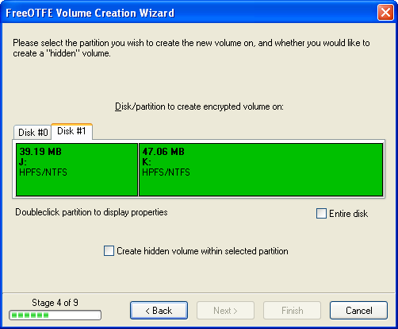
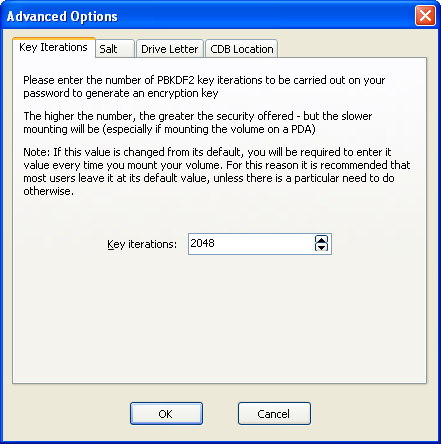
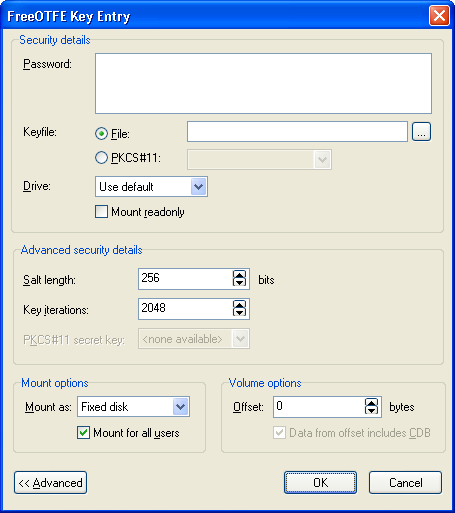
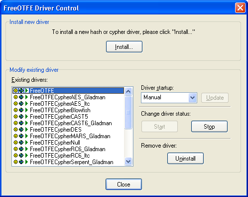

<meta content="text/html; charset=UTF-8" http-equiv="Content-Type">
<meta name="keywords" content="disk encryption, security, transparent, AES, OTFE, plausible deniability, virtual drive, Linux, MS Windows, portable, USB drive, partition">
<meta name="description" content="DoxBox: An Open-Source transparent encryption program for PCs. Using this software, you can create one or more &quot;DoxBoxes&quot; on your PC - which appear as disks, anything written to these disks is automatically encrypted before being stored on your hard drive.">

<TITLE>Advanced Topics</TITLE>
<link href="styles_common.css" rel="stylesheet" type="text/css">

<link rel="shortcut icon" href="../src/Common/Common/images/DoxBox.ico" type="image/x-icon">

_[DoxBox](http://DoxBox.squte.com/): Open-Source disk encryption for Windows_

***

## Advanced Topics

* * *
 
<A NAME="level_3_heading_1">

### Keyfiles
</A>

A "keyfile" is a small file (about 512 bytes) which can optionally be created for a volume, and contains a copy of the information required to mount a DoxBox. Keyfiles are encrypted based a user-supplied keyfile password, which must be supplied in order to use the keyfile.

 More than one keyfile can be created for the same volume. 

Keyfiles are useful as they allow critical information which is required in order to mount a particular volume to be stored separately to the volume which they relate to; on a floppy disk, or USB drive, for example - which would be too small to store the entire volume on. In this way, your volume may be stored on your computer, but the information required to access it can be stored in a physically more secure location (e.g. in a locked safe)

In a business environment, keyfiles may be used as a form of password recovery, or to reset forgotten passwords. When confidential information is held within a DoxBox volume, a keyfile can be created for that volume and stored in a safe location. Should the employee which normally uses the volume be unavailable, or cannot remember the volume's password, the volume may still be mounted using a keyfile that has was previously created for it (together with that keyfile's password) - even if the _volume's password_ has been subsequently changed.

Keyfiles may also be used to provide multiple users with access to mount and use the same volume; each using a password of their own choosing.

Note: Keyfiles are _specific_ to the volume they are created for! Although a keyfile for one volume may be able to successfully _mount_ another volume, the virtual drive shown will appear to be unformatted - the files within the volume will remain securely encrypted and unreadable.

<A NAME="level_4_heading_1">

#### Creating a new keyfile
</A>

To create a new volume, select "Tools | Create keyfile..." to display the "keyfile wizard", which will guide you through the process in a series of simple steps.

<A NAME="level_4_heading_2">

#### Mounting a volume using a keyfile
</A>

The process of mounting a volume using a keyfile is identical to the normal mount procedure, with the exceptions that:

1. The password used should be the _keyfile's_ password, and _not the volume's password_.
1. The full path and filename of the keyfile should be entered as the "keyfile file"

* * *
 
<A NAME="level_3_heading_2">

### Partition/Entire Disk Based Volumes
</A>

As well as being able to storing encrypted volumes in flat files, DoxBox also provides the option of encrypting partitions, and even entire physical disks, by selecting "Partition/disk" when prompted during the volume creation process.

It is _not_ recommended that inexperienced users do this - is the kind of operation that should only be carried out by those familiar with disk partitioning and fully understand what they're doing.

<A NAME="level_4_heading_3">
#### Safety Precautions
</A>

It is **_extremely important_** that you make **_absolutely sure_** you have selected the correct disk/partition to be used when creating a new partition based volume!

<A NAME="level_5_heading_1">
##### Backing up
</A>

The volume creation process will overwrite the first 512 bytes of the selected partition (or start of the disk, if using the entire disk).

You might wish to use the DoxBox's backup functionality ("Tools | Critical data block | Backup...") to back up this part of the disk, prior to creating a partition/disk based volume - which will allow you to revert the changes DoxBox makes to your partition/disk should you realise that you've selected the wrong one.

Note: Such a backup will be of limited use after the volume created has been mounted and formatted, since formatting will carry out further overwrites to the partition/disk.

Ideally, you should backup your entire system before creating encrypted partitions, just to be on the safe side - though this is unlikely to be particularly practical for many users.

<A NAME="level_5_heading_2">
##### Create New Volumes as an Administrator
</A>

The partition display shown by DoxBox will give more information about the partitions on a disk (e.g. drive letters allocated, size of partitions, proportional display) when used by a user with administrative privileges. A user with normal privileges will be shown less information due to their restricted access rights.

_New volume wizard showing full partition information_

Therefore, it is _recommended_ that you create any new partition based volumes while logged in as an administrator. To do this under Windows Vista, you will need to run DoxBox with elevated permissions:
	locate the "DoxBox.exe" executable where you installed it, rightclick on this executable and select "Run as administrator" from the context menu.

<A NAME="level_4_heading_4">

#### Special Note for Windows Vista x64 (64 bit) and Windows 7 (64 bit) Users
</A>

In order to format a new _partition or disk based volume_ under Windows Vista x64 (64 bit), the volume must be mounted while DoxBox is running with elevated permissions.

To do this:

1. Locate "FreeOTFE.exe" where you installed it, rightclick on this executable, and select "Run as administrator" from the context menu)
1. Mount the partition/disk as normal
1. Format the mounted volume

This procedure only needs to be carried out _once_ in order to format the volume; it may subsequently be mounted and used by any user.

Elevated permissions are _not_ required to format file based volumes.

* * *
 
<A NAME="level_3_heading_3">
### Creating Hidden Volumes
</A>

DoxBox offers users the ability to create "hidden Boxes" stored inside other "outer" Boxes.

To create a hidden DoxBox:

1. Open the 'outer' DoxBox. Right click and click 'properties'.
1. copy the value shown as 'default hidden offset'
1. If the Box you wish to create a hidden box in is open, lock it.
1. Start the volume creation wizard as normal (select "File | New..." from the main menu).
1. When prompted to select between creating a file or partition based volume, select "File" or "Partition", depending on whether the _host volume_ you wish to use is file or partition based.
1. When prompted for the filename/partition to create your hidden volume on, select the <I>host</I> file/partition you wish to create the hidden volume inside.
1. The next step in the wizard will prompt you to enter an offset. The offset is the number of bytes from the start of the host volume where you wish the hidden volume to begin. Make sure that the offset you specify is large enough such that it does not overwrite any of the system areas of that host volume (e.g. the FAT), or files already written to it.
1. Continue with the volume creation wizard as normal.

To mount your hidden volume, proceed as if mounting the _host_ volume, but when prompted to enter your password, click the "Advanced" button and enter the offset. (See the section on advanced password entry options).

Make sure you remember the value you enter for the offset value! For security reasons, DoxBox doesn't store this information anywhere, and so you will have to enter the same offset into the password entry dialog every time you wish to mount your hidden volume.

More than one hidden volume can be stored within the same host volume, by using different offsets

If you create a hidden volume within an existing volume, _be warned_: subsequently mounting and adding data to the _host_ volume can potentially result in parts of the hidden volume being overwritten, and its data destroyed. This is by design, and increases the security of the hidden volume.

Please see the [Plausible Deniability](plausible_deniability.md) section for further information on the practical uses and considerations of hidden volumes.

* * *
 <!-- ---------------------------------------------------------------------------- -->
<A NAME="level_3_heading_4">
### Volume Creation: Advanced Options
</A>

At the end of the volume creation process, DoxBox will display a summary of the volume it is about to create. At this stage, more advanced options be configured for the new volume, by selecting the "Advanced..." button.

      _Advanced volume creation options_

<A NAME="level_4_heading_5">

#### Key Iterations
</A>

Before the user's password is used to encrypt/decrypt the CDB, it is processed using PBKDF2 to increase security.

This tab allows the number of PBKDF2 iterations to be set by the user; higher values increase security, but will also increase the amount of time taken to mount the volume.

The default number of key iterations is 2048.

<A NAME="level_4_heading_6">

#### Salt
</A>

Before the user's password is used to encrypt/decrypt the CDB, it is processed using PBKDF2 to increase security.

Part of this processing involves the use of a random "salt" value, which reduces the risk of dictionary based attacks. This tab allows the length of the salt value (in bits) to be set by the user.

_It should be noted that every time a volume which has a non-default (256 bit) salt length is mounted, the user must specify the correct salt length (unless using a keyfile; in which case the keyfiles salt length must be specified) by using the "Advanced" options available on the DoxBox password entry dialog._

The default salt length is 256 bits. Any salt length entered must be a multiple of 8 bits.

<A NAME="level_4_heading_7">

#### Drive Letter
</A>

By default, DoxBox will use the next available drive letter when mounting a volume.

This behaviour can be changed to use a specific drive letter on a volume-by-volume basis by setting it on this option.

The default setting here is "Use default"; use the next available drive letter

Note: If the chosen drive letter is in use at the time of mounting, the next free drive letter will be used

<A NAME="level_4_heading_8">
#### CDB Location
</A>

Normally, a volume's CDB will be stored as the first 512 bytes of the volume.

However, this does increase the size of the volume by the size of the CDB, which can DoxBox volumes more distinctive, and making it slightly more obvious that a volume file _is_ volume file.

This is most clearly shown when creating a file based volume: a 2GB volume, for example, will be 2,147,484,160 bytes in length - made up of a 2,147,483,648 byte (2GB) encrypted disk image, plus a 512 byte embedded CDB.

To reduce this, it is possible to create a volume _without_ an embedded CDB; the CDB begin stored in a separate file as a standard DoxBox keyfile.

In this case, a 2GB volume would comprise of a 2,147,483,648 byte (2GB) encrypted disk image, plus a separate 512 byte keyfile which may be stored in a separate location to the volume.

Note that if you store the volume's CDB in a keyfile, you will _always_ need to supply a keyfile when mounting the volume, and ensure that the "Data from offset includes CDB" advanced option shown on the DoxBox password entry dialog shown when mounting must be _unchecked after the keyfile is specified_.

By default, DoxBox includes the CDB will be included as part of the volume.

<A NAME="level_4_heading_9">

#### Padding
</A>

"Padding" is additional random data added to the end of a volume file. Any padding added will not be available for use as part of the mounted volume, and serves to increase the size of the volume.

Encrypted volumes typically have a file size that is a multiple of 512 bytes, or a "signature size" beyond the last 1MB boundry. To prevent this, you may wish to append random "padding" data to the new volume.

Padding also reduces the amount of information available to an attacker with respect to the maximum amount of the encrypted that may actually be held within the volume.

* * *

<A NAME="level_3_heading_5">
### Password Entry: Advanced Options
</A>

_Note: This section only covers the password entry dialog shown when mounting DoxBox volumes. For mounting Linux volumes, please see the section on [Linux volumes](Linux_volumes.md)._

 

<A NAME="level_4_heading_10">

#### Advanced Security Details
</A>

<A NAME="level_5_heading_3">

##### Salt length
</A>

This should be set to the number of salt bits used in the PBKDF2 processing of the user's password, before using it to decrypt the volume's CDB/keyfile being used.

By default, this is set to 256 bits - the same default length used when creating a new volume.

<A NAME="level_5_heading_4">

##### Key iterations
</A>

This should be set to the number of key iterations used in the PBKDF2 processing of the user's password, before using it to decrypt the volume's CDB/keyfile being used.

By default, this is set to 2048 iterations - the same default number used when creating a new volume.

<A NAME="level_5_heading_5">

##### PKCS#11 secret key
</A>

This option is only available if PKCS#11 support is enabled (see the section on [Security Token/Smartcard Support](pkcs11_support.md) for more information on how to use this setting.

<A NAME="level_4_heading_11">

#### Mount Options
</A>

_(PC version only)_

<A NAME="level_5_heading_6">

##### Mount as
</A>

DoxBox volumes may be mounted as any of the following types of virtual drive:

* Fixed disk
* Removable disk
* CD
* DVD

Usually, users should select removable disk.

Selecting the "removable disk" option causes the volume to be mounted as though it was a removable drive, e.g. a USB flash drive. For volumes mounted in this way, among other things, deleted files will not be moved to a "recycle bin" on the volume, but will be deleted immediately.

By default, DoxBox mounts volumes as a removable disk.

<A NAME="level_5_heading_7">

##### Mount for all users
</A>

If this option is checked, mounted drives will be visible to all users logged onto the PC.

By default, this option is checked.

<A NAME="level_5_heading_8">

##### Volume Options
</A>

These options are intended for use with hidden volumes, and volumes which were created without a CDB embedded at the start of the volume

##### Offset

When attempting to mount a _hidden volume_, this should be set to the offset (in bytes) where the hidden volume starts, as specified when creating it.

By default, this is set to an offset of 0 bytes.

##### Data from offset includes CDB

This checkbox is only enabled if a keyfile has been specified.

If you are attempting to mount either a hidden, or normal, volume which was created _without_ a CDB embedded at the start of the volume, this checkbox should be changed so that it is _unchecked_.

For mounting all other volumes, this checkbox should be checked.

By default, this checkbox is checked.

* * *

<A NAME="level_3_heading_6">

### Driver Control
</A>

The driver control dialog may be accessed by selecting "File | Drivers...". From here you may see all drivers installed, and their current state.

A summary of all available hash and cypher algorithms can be found by selecting "Help | List hashes..."/"Help | List cyphers...".

      _Driver control dialog_

<A NAME="level_4_heading_13">

#### Installing New Drivers
</A>

DoxBox drivers may be installed by clicking "Install...", and selecting the driver file to be installed.

DoxBox will then install the driver selected (adding it to the list of installed drivers), start it, and sets it to automatically start up whenever the PC boots up.

More than one driver can be installed at the same time by selecting holding down &lt;SHIFT&gt;/&lt;CTRL&gt; when selecting driver files in the "Open" dialog shown when "Install..." is clicked

    
<A NAME="level_4_heading_14">

#### Modify Existing Drivers
</A>

The lower half of the Driver Control dialog lists all drivers currently installed, together with their status indicated with the icons listed below:

<TABLE>
<TBODY>
<TR>
<TH>Column</TH>
<TH>Icon</TH>
<TH>Description</TH>
</TR>
<TR>
<TD COLSPAN="1" ROWSPAN="2">Start up</TD>

<TD></TD>

<TD>Driver must be started manually</TD>

</TR>
<TR>
<TD></TD>

<TD>Driver will be started automatically when the computer starts up</TD>

</TR>
<TR>
<td colspan="1" rowspan="2">Installation mode</TD>

<TD></TD>
<TD>Driver is installed normally _ (no icon) _ 
</TD>
</TR>
<TR>
<TD></TD>
<TD>Driver is installed in portable mode _ (world icon)_ </TD>

</TR>
<TR>
<td colspan="1" rowspan="2">Status</TD>

<TD></TD>

<TD>Driver started</TD>

</TR>
<TR>
<TD></TD>

<TD>Driver stopped</TD>

</TR>

</TBODY>
</TABLE>

After selecting an installed driver from the list, the operations listed below may be carried out on it:

<A NAME="level_5_heading_9">
##### Driver startup
</A>

Changes whether the selected driver is automatically started when the PC boots up. After changing this setting, click "Update" for the change to take effect.

<A NAME="level_5_heading_10">
##### Change driver status
</A>

The start/stop buttons start and stop the selected driver

<A NAME="level_5_heading_11">
##### Uninstall
</A>

Uninstalls the selected driver, and removes it from the drivers list.

