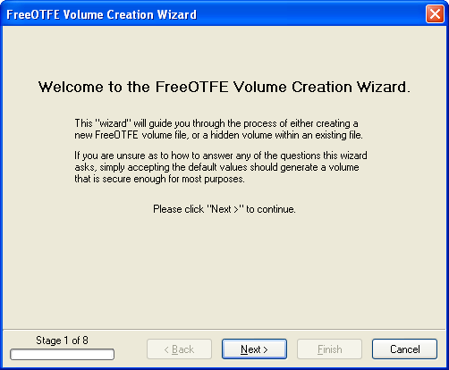
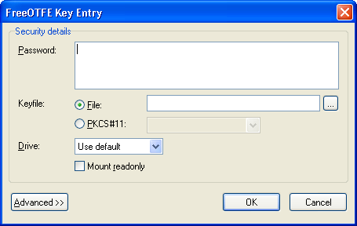
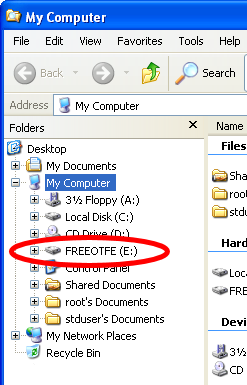
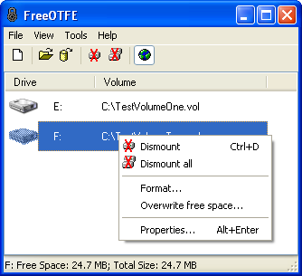

<meta content="text/html; charset=UTF-8" http-equiv="Content-Type">
<meta name="keywords" content="disk encryption, security, transparent, AES, OTFE, plausible deniability, virtual drive, Linux, MS Windows, portable, USB drive, partition">
<meta name="description" content="DoxBox: An Open-Source transparent encryption program for PCs. Using this software, you can create one or more &quot;DoxBoxes&quot; on your PC - which appear as disks, anything written to these disks is automatically encrypted before being stored on your hard drive.">

<meta name="author" content="Sarah Dean">
<meta name="copyright" content="Copyright 2004, 2005, 2006, 2007, 2008 Sarah Dean">
<meta name="ROBOTS" content="ALL">

<TITLE>Getting Started Guide</TITLE>

<link href="./styles_common.css" rel="stylesheet" type="text/css">

<link rel="shortcut icon" href="../src/Common/Common/images/DoxBox.ico" type="image/x-icon">

_[DoxBox](http://DoxBox.squte.com/): Open-Source disk encryption for Windows_

***
      
            
## Getting Started Guide

Pretty much everything in DoxBox works as it seems, and should be fairly self explanatory. If there's anything you're not too sure of, most times an educated guess will give you the right answer.

  * [Installation/Portable mode](#level_3_heading_1)
  * [Using DoxBox](#level_3_heading_2)
  * [Creating a new volume](#level_3_heading_3)
  * [Mounting volumes](#level_3_heading_4)
  * [Dismounting volumes](#level_3_heading_5)
  * [Changing a volume's keyphrase](#level_3_heading_6)

* * * 
<A NAME="level_3_heading_1">
### Installation/Portable mode
</A>

Before DoxBox can be used, it must first either be installed or unzipped from the portable zipfile.

Please see the section on [Installation and Upgrading](installation_and_upgrading.md) for instructions on how to do this.

* * * 
<A NAME="level_3_heading_2">
### Using DoxBox
</A>

Once DoxBox is installed (or started in portable mode), securing your data is simple:

1. Create a DoxBox to store your encrypted data on (or several, if you choose!)
1. 'Open' the Box created.
1. Once opened, it will appear as a new drive on your computer.

		
		
	_Anything_ and _everything_ stored on this drive (documents, pictures, videos, software - whatever you like) will be automatically encrypted and stored within the Box you created, at the time that it's written to the drive.
	
	
	The encryption process is totally transparent, and is carried out on-the-fly as data is written to the drive. At no time is any unencrypted data stored on the disc. Similarly, decryption is carried out transparently when data is read from it.	
	
	You can drag files to and from this drive, open and save files from applications to it, run applications directly from it - in fact, _everything_ that you can do with a normal drive, you can do with a DoxBox.

1. To secure your data, simply 'lock' the Box. At that point, the drive disappears and the encryption/decryption key is overwritten in memory - making your data totally inaccessible until the keyphrase is supplied, and the DoxBox is opened again.

The following sections give more detailed instructions on how do carry out each of these steps.

* * * 
<A NAME="level_3_heading_3">
### Creating a new Box
</A>

In order to use DoxBox, you must first create a "DoxBox" (also called a "volume") to represent your new drive.

This is a fairly straightforward process, and consists of using DoxBox to create a large file (or setup a partition) on your computer's hard drive. 

 

This volume will hold an encrypted "disk image" of your DoxBox, and is where DoxBox will store all data written to your virtual drive. 

This file (or partition) can subsequently be "mounted", at which point a virtual drive will appear on your computer - anything stored on one of these virtual drives will be automatically encrypted before being written to volume file.

To create a new volume, select "File | New..." menu-item to display the "new volume wizard", which will guide you through the process in a series of simple steps.

<TABLE WIDTH="100%">
  <TR>
    <TD WIDTH="50%" class="screenshot_img" >
      
    </TD>
  </TR>
  <TR>
    <TD COLSPAN="2">
      _New volume wizard_
    </TD>
  </TR>
</TABLE>

When prompted to select between creating a file or partition based volume, new users should select "File". This is the safer of the two options - partition based volumes are intended for more advanced users.

Some users who are unfamiliar with disk encryption systems may not understand all of the options they are presented with. If you feel that you are in this position, you should probably simply accept the default values you are presented with, which will give you a volume that will be secure enough for your needs. 

DoxBox is a highly flexible system that caters for both novice and advanced users alike; many of the options that the volume creation wizard provides you with are intended for more advanced users who understand the implications of the options provided (e.g. storing a volume's CDB separately to the volume file it relates to), and how they operate.

 

  You may want to create and use multiple volumes; one to store work related files, one for personal files, etc    

 

Do not simply copy an existing volume file to create a new one - even if you change the keyphrase on the "new" volume. If you do this, both volumes will have the same encrypted master key, which reduces the amount of security offered.  

* * * 
<A NAME="level_3_heading_4">
### Mounting volumes
</A>

Once you have created a volume, it must be "mounted" in order for it to appear as a virtual drive on your computer.

Select "File | Mount file..." menu-item to mount a file based volume, or "File | Mount partition..." to mount a partition based volume.

You will then be prompted to select which volume you wish to mount; do so, and click "OK" to display the keyphrase entry dialog.

 

   You can also mount volumes by dragging and dropping the encrypted volume file onto the main DoxBox window.     

<TABLE WIDTH="100%">
  <TR>
    <TD WIDTH="50%" class="screenshot_img" >
      
    </TD>
  </TR>
  <TR>
    <TD COLSPAN="2">
      _Keyphrase entry dialog_
    </TD>
  </TR>
</TABLE>

Enter your volume's keyphrase, and click "OK". If the correct keyphrase has been entered, the volume will be mounted and shown in the main DoxBox window.

 
  To reduce the time taken DoxBox spends mounting volumes, see the FAQ [How can I speed DoxBox up when mounting my volumes?](FAQ.md#bm)  

If this is the first time you have mounted a particular volume after creating it, you will need to format the virtual drive before it can be used. To do so, select the mounted volume shown in the main DoxBox window, and select the "Tools | Format..." menu-item. The standard MS Windows format utility will be displayed, and should be used to carry out the format.

If you wish to use your volume on both PCs or with DoxBox Explorer, it should be formatted on a PC as either FAT or FAT32 

 

To increase security, it is recommended that after a volume is formatted, it is overwritten with random data. However, this process can take some time and may be skipped if required. See section on [plausible deniability](plausible_deniability.md) for further details  

Once mounted, a virtual drive can be used in the same way _as any other drive_ (e.g. they will appear in Windows Explorer and in Open/Save dialogs shown by applications); transparently encrypting and decrypting your files as and when needed.

<TABLE WIDTH="100%">
  <TR>
    <TD WIDTH="50%" class="screenshot_img" >
      
    </TD>
  </TR>
  <TR>
    <TD COLSPAN="2">
      _Explorer showing mounted volume_
    </TD>
  </TR>
</TABLE>

 
 You can have more than one volume mounted at the same time    

* * * 
<A NAME="level_3_heading_5">
### Dismounting volumes
</A>

Once you have finished using your secured drive, it should be "dismounted". This will remove the virtual drive, and wipe any sensitive information DoxBox has stored in the computers memory.

Select which volumes shown in the main DoxBox window you wish to dismount and click the "File | Dismount" menu-item; or use the context menu shown by right-clicking on one of the volumes shown

<TABLE WIDTH="100%">
  <TR>
    <TD WIDTH="50%" class="screenshot_img" >
      
    </TD>
  </TR>
  <TR>
    <TD>       (PC version)
    </TD>
  </TR>
  <TR>
    <TD COLSPAN="2">
      _Main window context menu_
    </TD>
  </TR>
</TABLE>

To quickly dismount all mounted volumes, use the "Dismount all" menu-item.

* * * 
<A NAME="level_3_heading_6">
### Changing a volume's keyphrase
</A>

To change a volume's keyphrase (or a keyfile's keyphrase), select the "Tools | Change volume/keyfile keyphrase/details..." menu-item to display the "change keyphrase wizard", which will guide you through the process in a series of simple steps.

Note that volumes must be _dismounted_ first before they can be modified in this way.

 

You may also change certain volume/keyfile details via this wizard; for example, the default drive letter which the volume will normally be mounted as. Advanced users may also change more technical details, such as the length of salt used in encrypting the volume's CDB/keyfile    

 

In common with most disk encryption systems, DoxBox uses an "encrypted master key" system to secure volumes. Every DoxBox has its own "master encryption key" which is generated when the volume is created. This master key is used to carry out the actual encryption/decryption process used to secure data stored within the volume. A volume's master encryption key is, in turn, encrypted with the (PBKDF2 processed) user's keyphrase. As a consequence, DoxBox doesn't need to decrypt and re-encrypt the entire volume to change the user's keyphrase - only the encrypted master encryption key. This makes changing a volume/keyfile's keyphrase an extremely quick, and risk free, operation when compared to a complete volume re-encryption.     

