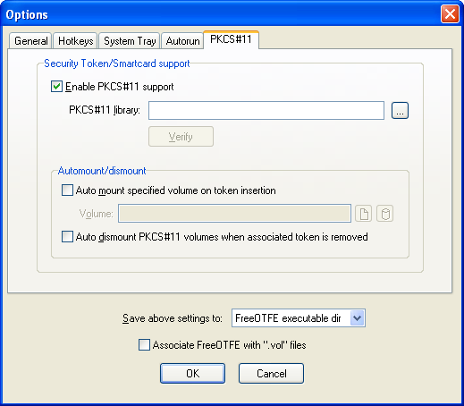
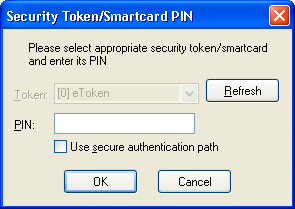

<meta content="text/html; charset=iso-8859-1" http-equiv="Content-Type">
<meta name="keywords" content="disk encryption, security, transparent, AES, OTFE, plausible deniability, virtual drive, Linux, MS Windows, portable, USB drive, partition">
<meta name="description" content="DoxBox: An OpenSource 'on-the-fly' transparent disk encryption program for PCs. Using this software, you can create one or more &quot;virtual disks&quot; on your PC - anything written to these disks is automatically, and securely, encrypted before being stored on your computers hard drive.">

<meta name="author" content="Sarah Dean">
<meta name="copyright" content="Copyright 2004, 2005, 2006, 2007, 2008 Sarah Dean">
<meta name="ROBOTS" content="ALL">

<TITLE>Security Token/Smartcard Support</TITLE>

<link href="./styles_common.css" rel="stylesheet" type="text/css">

<link rev="made" href="mailto:sdean12@sdean12.org">
<link rel="shortcut icon" href="./images/favicon.ico" type="image/x-icon">

[DoxBox](http://DoxBox.squte.com/)

_OpenSource disk encryption for Windows_

      
            

## Security Token/Smartcard Support

 
<TABLE class="note">
  <TR>
    <TD> 
    </TD>
    <TD> This section applies to the PC version of FreeOTFE _only_      </TD>
  </TR>
</TABLE>

FreeOTFE supports all security tokens/smartcards (referred to as "tokens" in this documentation) which conform to the PKCS#11 (aka Cryptoki) standard, providing two factor authentication of FreeOTFE volumes.

There are two ways in which tokens can be used:

1. As a secure keyfile store
1. To add an additional level of encryption to keyfiles/volumes

In both cases case, the token's password (typically called a "PIN" - although not limited to numbers) is required in order for the token to be used.

These two methods can be used independently, or combined together.

<UL>
  * [Initial configuration](#level_3_heading_1)
  * [Secure Keyfile Store](#level_3_heading_2)
  * [Token Encryption](#level_3_heading_3)
  * [PIN Entry](#level_3_heading_4)
</UL>

* * * 
<A NAME="level_3_heading_1">
### Initial configuration
</A>

In order to use tokens, FreeOTFE must first be configured to use the appropriate PKCS#11 library:

1. Go to "View | Options..." 
1. Select the "PKCS#11" tab
1. Check the "Enable PKCS#11 support" checkbox
1. The filename of the PKCS#11 library you wish to use (see table below). Note: In most cases you shouldn't need to enter the full path to the DLL, just its filename.
1. Click "Verify" to run a quick sanity check to ensure that the library looks viable
1. Set "Save above settings to" be (for example) "FreeOTFE executable dir"
1. Click "OK"

<TABLE WIDTH="100%" >
  <TR>
    <TD WIDTH="100%" class="screenshot_img" >
      
    </TD>
  </TR>
  <TR>
    <TD>       _Options dialog; PKCS#11 tab_     </TD>
  </TR>
</TABLE>

The menuitem under the "Tools" menu should then be enabled, as should
the options (when appropriate) on the password entry dialog when
mounting FreeOTFE volumes

A list of driver library names supplied by common manufacturers may be found at [Appendix E: PKCS#11 Driver Libraries](pkcs11_drivers.htm)

* * * 
<A NAME="level_3_heading_2">
### Secure Keyfile Store
</A>

Keyfiles may be stored on tokens in a similar fashion to which they can be stored on (for example) a USB flash drive. However, unlike storing a keyfile on a USB flash drive, those stored on a token require the token's PIN to be entered before they can be accessed.

<A NAME="level_4_heading_1">
#### Usage
</A>

To add a keyfile to your token:

<OL>
* Create a keyfile for your volume as per normal
* Plug in/insert your token
* Go to "Tools | PKCS#11 Token management..."
* Enter your token's PIN and click "OK"
* The token management dialog should be displayed; select the "Keyfiles" tab
* Click "Import..."
* Select the keyfile previously created and click "OK".
</OL>

To use a keyfile stored on a token:

<OL>
* Follow the normal procedure for mounting your DoxBox
* When shown the password prompt, select "PKCS#11" as the keyfile option; you will then be prompted to authenticate yourself to the token
* Enter your token's PIN and click "OK"
* Select the keyfile stored on your token, and proceed as normal by entering your keyfile's password, etc and clicking "OK" to mount
</OL>

Note: More than one keyfile can be stored on a single token; however they must all have different names.

* * * 
<A NAME="level_3_heading_3">
### Token Encryption
</A>

PKCS#11 tokens can also be used to add a further level of encryption to volumes, by using the token to encrypt the volume's CDB and/or keyfile(s).

The keys ("secret keys") used for this encryption are automatically generated by a token and can never be duplicated, extracted or in any way copied from the token, _even if the token's PIN is known_. All encryption/decryption operations used to secure a keyfile/volume CDB are carried out _by the token itself_.

This mechanism therefore provides a means of "tying" a volume/keyfile to a physical token; preventing it from being mounted unless the token is present and its PIN is known.

It should be noted however, that since it is inherent that _no backups of the secret keys stored on a token can be made_, the loss of the token will result in the loss of all data stored on the volume it protects, unless a separate means of accessing the volume (e.g. a keyfile which isn't secured by the same PKCS#11 token) is available.

<A NAME="level_4_heading_2">
#### Usage
</A>

To encrypt a volume's CDB/keyfile:

<OL>
* Plug in/insert your token
* Go to "Tools | PKCS#11 Token management..."
* Enter your token's PIN and click "OK"
* The token management dialog should be displayed; select the "Secret keys" tab
* Click "New..."
* Enter a meaningful name of the token, and select the cypher to be used for the encryption

It should be noted that the range of cyphers available for use is determined by the capabilities of your token, and not FreeOTFE
* Click "OK" and the new key will be created

* Select the secret key to be used to encrypt your volume CDB/keyfile.
* Click "Secure..."

* In the dialog shown, specify the volume/keyfile to be encrypted. If you are trying to secure a hidden volume, enter the host volume's filename/partition.
* Leave the "offset" field set to zero, unless you are trying to secure a hidden volume - in which case this should be set to the offset where the hidden volume may be found.
* Click "OK".
</OL>

Note:
<UL>
* More than one secret key can be stored on a single token; however they must all have different names.
* The same secret key can be used to encrypt more than one volume CDB/keyfile.
</UL>

To use a volume/keyfile which has been double-encrypted by a token:

<OL>
* Follow the normal procedure for mounting your DoxBox
* When shown the password prompt, click the "Advanced >>" button to display the "Advanced security details" options
* Enter your token's PIN and click "OK"
* Select the secret key used to secure your volume/keyfile, and proceed as normal by entering your volume/keyfile's password, etc and clicking "OK" to mount
</OL>

* * * 
<A NAME="level_3_heading_4">
### PIN Entry
</A>

FreeOTFE will only prompt you to enter your token's PIN as and when it's needed. FreeOTFE does _not_ cache your PIN in any way

<TABLE WIDTH="100%" >
  <TR>
    <TD WIDTH="100%" class="screenshot_img" >
      
    </TD>
  </TR>
  <TR>
    <TD>       _PKCS#11 PIN entry_     </TD>
  </TR>
</TABLE>

The PIN entry prompt will display a list of all tokens found on your system, showing the slot number the token is inserted in, and the token's label. If you have not yet inserted your token, do so and click "Refresh" to refresh the list.

If only one token is found, it will be selected automatically, and the token selection control will be disabled. Otherwise, select the token you wish to use, enter your PIN, and click "OK" to continue.

<A NAME="level_4_heading_3">
#### Secure authentication path
</A>

If your token hardware features a secure authentication path (e.g. a smartcard reader with PIN entry keypad), you can take advantage of it by selecting the "Use secure authentication path" checkbox when FreeOTFE prompts for the token's PIN.

